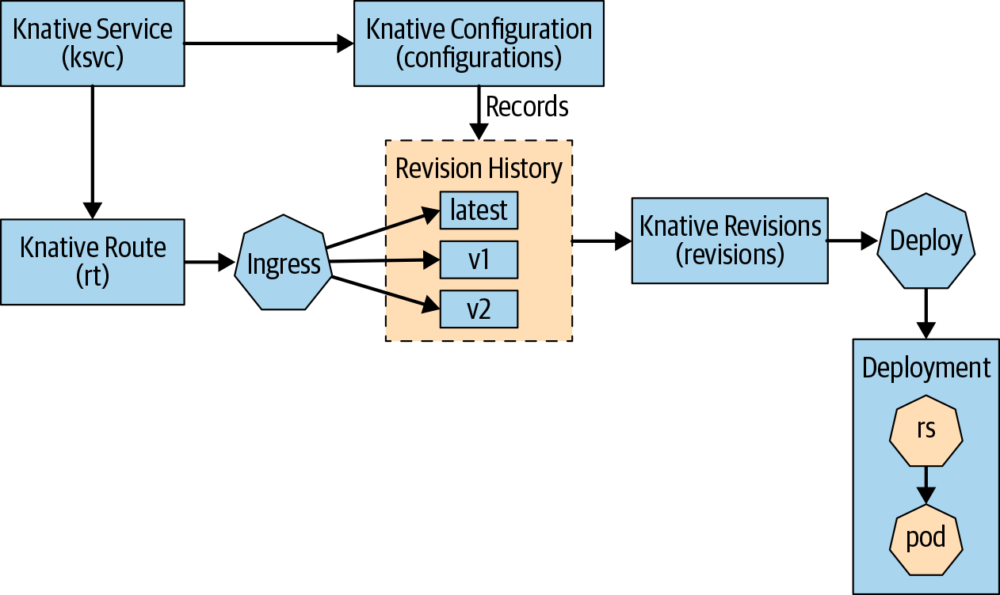

## 流向


## 创建 ksvc
```yaml
apiVersion: serving.knative.dev/v1
kind: Service
metadata:
  name: greeter
spec:
  template:
    metadata:
      name: greeter-v1
    spec:
      containers:
        - image: quay.io/rhdevelopers/knative-tutorial-greeter:quarkus
          livenessProbe:
            httpGet:
              path: /healthz
          readinessProbe:
            httpGet:
              path: /healthz
```

## 查看 ksvc
```shell
kubectl get ksvc -n <namespace>
```

## 测试访问 ksvc 命令
```shell
curl -H "Host:greeter.chapter-2.example.com" 36.26.81.202:30687

######## 下面是脚本 ###########
#!/bin/bash
curl -H "Host:greeter.chapter-2.example.com" 36.26.81.202:30687
```

## 查看 configurations
```shell
kubectl get configurations -n <namespace>
```

## 更新
```yaml
apiVersion: serving.knative.dev/v1
kind: Service
metadata:
  name: greeter
spec:
  template:
    metadata:
      name: greeter-v2
    spec:
      containers:
        - image: quay.io/rhdevelopers/knative-tutorial-greeter:quarkus
          env:
            - name: MESSAGE_PREFIX
              value: Namaste
          livenessProbe:
            httpGet:
              path: /healthz
          readinessProbe:
            httpGet:
              path: /healthz
```

## 获取修订
```shell
kubectl get revisions -n <namespace>
```

## 获取路由
```shell
kubectl get routes -n <namespace>
```

## 流量转发
```yaml
apiVersion: serving.knative.dev/v1
kind: Service
metadata:
  name: greeter
spec:
  template:
    metadata:
      name: greeter-v2
    spec:
      containers:
        - image: quay.io/rhdevelopers/knative-tutorial-greeter:quarkus
          env:
            - name: MESSAGE_PREFIX
              value: Namaste
          livenessProbe:
            httpGet:
              path: /healthz
          readinessProbe:
            httpGet:
              path: /healthz
  traffic:
    - tag: v1
      revisionName: greeter-v1
      percent: 0
    - tag: v2
      revisionName: greeter-v2
      percent: 100
    - tag: latest
      latestRevision: true
      percent: 0
```

## canary
```yaml
apiVersion: serving.knative.dev/v1
kind: Service
metadata:
  name: greeter
spec:
  template:
    metadata:
      name: greeter-v2
    spec:
      containers:
        - image: quay.io/rhdevelopers/knative-tutorial-greeter:quarkus
          env:
            - name: MESSAGE_PREFIX
              value: Namaste
          livenessProbe:
            httpGet:
              path: /healthz
          readinessProbe:
            httpGet:
              path: /healthz
  traffic:
    - tag: v1
      revisionName: greeter-v1
      percent: 80
    - tag: v2
      revisionName: greeter-v2
      percent: 20
    - tag: latest
      latestRevision: true
      percent: 0
```

## canary shell script
```shell
#!/bin/bash

# 设置请求的 URL 和主机头
url="http://36.26.81.202:30687"
host="greeter.chapter-2.example.com"

# 循环发送请求
while true; do
    # 使用 curl 发送 GET 请求，并带上 Host 头
    curl -H "Host: $host" "$url"

    # 等待 1 秒后继续发送请求
    sleep 1
done
```