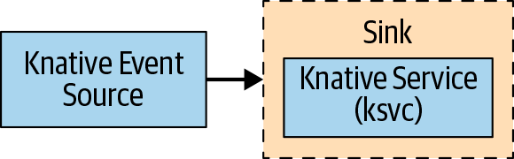
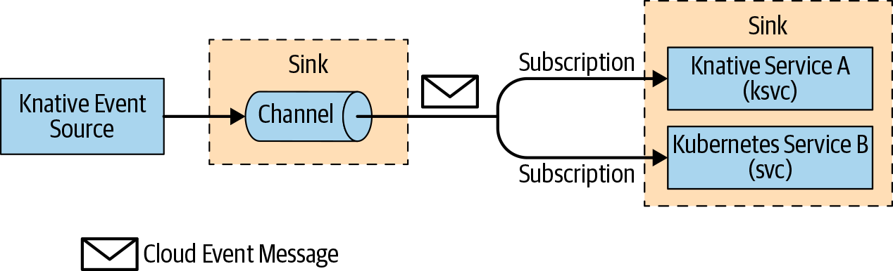
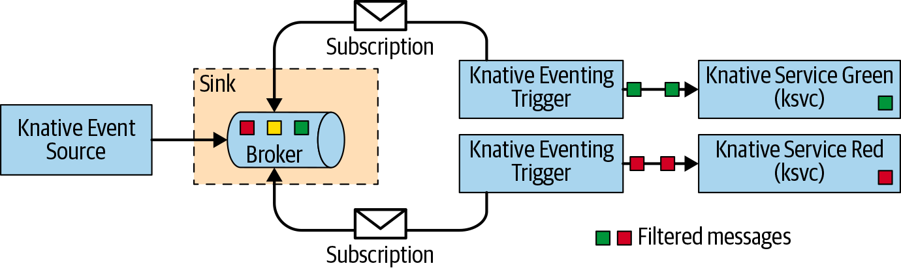

# 使用模式
### Source to Sink


### Channels and Subscriptions


### Brokers and Triggers


# PingSource 实践

### PingSource
```yaml
apiVersion: sources.knative.dev/v1
kind: PingSource
metadata:
  name: eventinghello-ping-source
spec:
  schedule: "*/2 * * * *"
  contentType: "application/json"
  data: '{"key": "value"}'
  sink:
    ref:
      apiVersion: serving.knative.dev/v1
      kind: Service
      name: eventinghello
```

### Service
```yaml
apiVersion: serving.knative.dev/v1
kind: Service
metadata:
  name: eventinghello
spec:
  template:
    metadata:
      name: eventinghello-v1
      annotations:
        autoscaling.knative.dev/target: "1"
    spec:
      containers:
        - image: quay.io/rhdevelopers/eventinghello:0.0.1
```