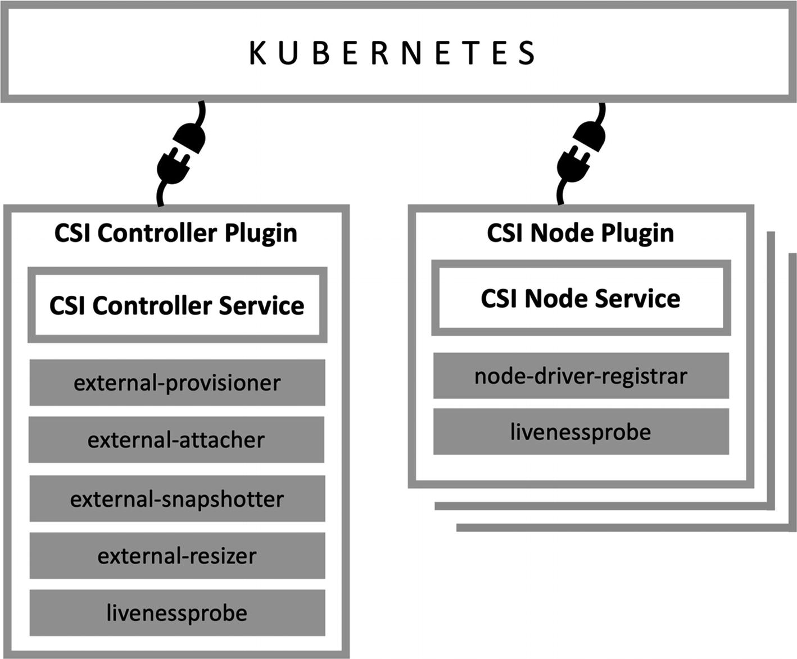

## 问题
```text
如何创建卷？

分配了多少容量？

附加的 Volume 在哪里？

如何提供存储的访问权限？

如何管理卷的备份和还原？
```

## 回答
```text
CSI 插件提供了两种能力：
1. 动态 分配/销毁 Volume
2. 连接/挂载 和 分离/卸载 Volume
文档：https://github.com/container-storage-interface/spec/blob/master/spec.md
```
```text
CSI 分为两个部分：Node Plugin、Controller Plugin
```
```text
Node Plugin：
Node Plugin 是一个 gRPC 服务器，运行在提供存储卷的节点上。

Node Plugin 主要负责将节点上的存储卷和 Kubernetes 集群进行交互。

它接受来自 Kubernetes 集群的请求，例如创建和删除存储卷的请求，并在本地执行这些请求。

当存储卷被创建时，Node Plugin 会在节点上创建一个挂载点，使 Kubernetes 中的 Pod 可以挂载这个存储卷，并在该挂载点上读取和写入数据。

因此，Node Plugin 是 Kubernetes 存储插件的一部分，它在 Kubernetes 集群和存储卷之间建立了一个连接。

Node Plugin 通常需要在集群的每个节点上运行。为了实现这一点，可以使用 Kubernetes 中的 DaemonSet 对象来部署它。

DaemonSet 会在每个节点上运行一个 Pod，并确保在每个节点上只有一个 Pod 运行。

这样，Node Plugin 就可以在每个节点上运行，以便为每个节点提供相应的存储服务。
```
```text
Controller Plugin:

Controller Plugin 是一个 gRPC 服务器，它可以运行在 Kubernetes 集群的任何一个节点上。

它的作用是为了管理 Kubernetes 存储的创建和删除过程。与 Node Plugin 不同，它并不是直接运行在节点上，而是可以在集群的任何节点上运行。

Controller Plugin 负责监听 Kubernetes API Server 中的存储类（StorageClass）和持久化卷声明（PersistentVolumeClaim）对象的创建和删除事件。

当 Kubernetes 用户或管理员创建或删除一个存储类或持久化卷声明时，Controller Plugin 会相应地调整存储供应商的状态。

它可以使用存储供应商提供的 API 或其他手段来创建和删除实际的存储卷，并将其绑定到持久卷声明上。

总之，Controller Plugin 是 Kubernetes 存储提供商的一个重要组件，负责管理存储的创建和删除过程，

并与 Kubernetes API Server 和 Node Plugin 进行通信以实现数据的存储和访问。
```

## CSI 工作流程
```text
CSI（Container Storage Interface）接口的存储方案的工作流程。该工作流程包括以下步骤：

首先，使用 CreateVolume 调用 Controller Plugin 来创建一个新的存储卷。
在这个步骤中，Controller Plugin 负责在存储提供者中创建新卷。

然后，使用 ControllerPublishVolume 调用来指示容器编排器要使用该卷所在的节点。
在这个步骤中，插件执行必要的工作，以使卷在给定节点上可用。

接下来，发送 NodePublishVolume 调用到在特定节点上运行的 Node Plugin 中，以发布工作负载已安排并希望使用该卷的信息。
在这个步骤中，Node Plugin 在特定的节点上将卷挂载到本地文件系统。

当需要删除存储卷时，使用 ControllerUnpublishVolume 和 NodeUnpublishVolume 调用来删除掉原来发布的信息。
最后，使用 DeleteVolume 调用从存储提供者中删除该卷。

这个工作流程使用了 CSI 标准接口，可以让不同的存储提供商以统一的方式与 Kubernetes 集群进行交互。

总结：
1. 创建
CreateVolume -> ControllerPublishVolume -> NodePublishVolume

2. 删除
DeleteVolume -> ControllerUnpublishVolume -> NodeUnpublishVolume
```

## sidecar container
```text
external-provisioner:

这个声明描述了 external-provisioner 组件在 Kubernetes 存储体系结构中的角色。

外部提供程序是一个 Kubernetes 控制器，它在 Kubernetes API 中监视 PersterentVolumeClaim (PVC)对象。

创建一个 pod 并配置了 pvc 后，Kubernetes 会创建一个 PersistentVolumeClaim 对象，描述了你需要的持久化存储的要求。

这时 external-provisioner 就会监听 PersistentVolumeClaim 对象的创建事件，

当它检测到新的 PersistentVolumeClaim 对象被创建时，它就会调用 CSI 插件的 CreateVolume 方法创建一个新的持久卷。

当插件创建完成后，external-provisioner 就会创建一个 PersistentVolume 对象，该对象描述了新创建的持久卷的详细信息。

这个 PersistentVolume 对象就可以被其他用户（比如你创建的 pod）引用，从而使用这个持久卷提供的持久化存储能力
```
```text
“external-attacher”是 Kubernetes CSI 驱动程序架构的一个组件，负责将卷连接到 Kubernetes 集群中的节点。

当一个 Pod 需要使用某个 PersistentVolumeClaim （PVC）时，它首先需要将该 PVC attach（附加）到一个 Node 上。

这个过程由 external-attacher 插件来完成。

external-attacher 监听 Kubernetes API 中的 PVC 对象，当发现有新的 PVC 对象创建时，

它会调用 CSI 插件的 ControllerPublish 函数将这个 PVC attach 到指定的 Node 上。

当一个 PVC 被 detach（分离）时，external-attacher 也会调用 CSI 插件的 ControllerUnpublish 函数将其从 Node 上 detach。

简单来说，external-attacher 插件的作用就是帮助 Kubernetes 中的 Pod 将 PVC 附加（attach）到 Node 上，

让 Pod 可以使用其中的数据卷。
```
```text
external-snapshotter 是一个树外的 Kubernetes 项目，

它提供了一种使用容器存储接口(Container Storage Interface，CSI)驱动程序创建、删除和列出 VolumeSnapshot 的方法。

外部快照程序监视 Kubernetes API 中的 VolumeSnapshoContent 资源，

当请求新快照时，它调用 CSI 驱动程序的 CreateSnapshot 函数来创建卷的快照。

类似地，当删除快照或请求快照列表时，外部快照程序分别调用 CSI 驱动程序的 DeleteSnapshot 和 ListSnapshot 函数。
```
```text
external-resizer 是一个部署在 Kubernetes 集群中的 Pod，

它的主要功能是监视 Kubernetes API 中的 PersistentVolumeClaim 对象，并在这些对象发生更改时采取行动。

当外部应用程序向 Kubernetes 提出更多的存储请求时，external-resizer 会检测到这些更改，

并调用 CSI 驱动程序中的 ControllerExpandVolume 函数来扩展已有的卷。

这意味着在存储卷容量不足时，external-resizer 可以根据应用程序的需求自动调整存储大小。

值得注意的是，使用 external-resizer 需要 CSI 驱动程序实现 ControllerExpandVolume 函数，否则 external-resizer 将无法生效。
```
```text
node-driver-registrar: 

在 Kubernetes 中，每个节点（Node）都运行一个 kubelet 进程来管理节点上的容器。

在 CSI 插件中，为了让 kubelet 认识到 CSI 驱动程序并可以使用它来挂载存储卷，

需要一个组件来注册驱动程序，这个组件就是 node-driver-registrar。

具体来说，node-driver-registrar 会从 CSI 插件的 gRPC 终端点获取 CSI 驱动程序信息，包括其名称、版本、Socket 文件路径等，

并将这些信息注册到 kubelet 中，以便 kubelet 可以调用 CSI 驱动程序挂载存储卷。

当 CSI 驱动程序更新或升级时，node-driver-registrar 也会相应地更新 kubelet 中的驱动程序信息，

以确保 kubelet 使用最新的 CSI 驱动程序。
```
```text
为了确保 CSI 驱动程序插件的稳定性和可靠性，Kubernetes 集群使用一个活性探针来监视插件端点的健康状况。

活性探针是一种诊断工具，用于确定吊舱内的容器是否正常运行。

对于 CSI 驱动程序，活性探测检查插件的端点，以确保它们可用并响应请求。

如果活性探测器检测到端点没有响应，它会将 pod 标记为不健康，并触发 pod 重启，这有助于确保驱动程序插件的可用性和稳定性。
```


## 示例日志
```shell
$ kubectl -n kube-system logs csi-hostpathplugin-0 hostpath | grep -A 3 CreateVolume
* GRPC call: /csi.v1.Controller/CreateVolume
* GRPC request: {
  "accessibility_requirements":{
    "preferred":[
      {
      "segments":{
          "topology.hostpath.csi/node":"minikube"
          }
      }   
    ],  
    "requisite":[
      {
        "segments":{
          "topology.hostpath.csi/node":"minikube"
        }
      }
    ] 
  },
  "capacity_range":{
    "required_bytes":1073741824
  },
  "name":"pvc-dd4570bc-58cc-4074-a284-b13651970d17",
  "volume_capabilities":[
      {
        "AccessType":{
          "Mount":{}
        },
        "access_mode":{
          "mode":1
        }
      }
  ]
}
created volume af5c51ee-7aa2-11eb-a960-0242ac110004 at path /csi-data-dir/af5c51ee-7aa2-11eb-a960-0242ac110004
* GRPC response: {
  "volume":{
    "accessible_topology":[
        {
          "segments":{
            "topology.hostpath.csi/node":"minikube"
          }
        }
    ],
    "capacity_bytes":1073741824,
    "volume_id":"af5c51ee-7aa2-11eb-a960-0242ac110004"
  }
}
```