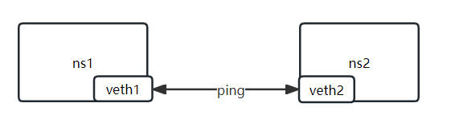

## Veth 设备对
```shell
# 添加设备对
ip link add name <veth-name> type veth peer name <veth-name>

# 设置设备到命名空间
ip link set <veth-name> netns <namespace-name>

# 设置 ip
ip netns exec <namespace-name> ip addr add local 10.12.0.2/24 dev veth1

# 显示设备对兄弟名称
ip link show <veth-name>
```

## 练习
```shell
# 添加两个命名空间
ip netns add ns1 && ip netns add ns2

# 添加设备对
ip link add name veth1 type veth peer name veth2

# 移动设备对
ip link set veth1 netns ns1 && ip link set netns ns2

# 设置设备对ip地址
ip netns exec ns1 ip add add local 10.12.0.2/24 dev veth1 && ip netns exec n2 ip addr add local 10.12.0.3/24 dev veth2

# 启动设置
ip netns exec ns1 ip link set veth1 up && ip netns exec ns2 ip link set veth2 up

# 测试网络
ip netns exec ns1 ping 10.12.0.3
```

## 图解


## 扩展
```text
1. 10.0.0.0/8：这是一个私有网络地址空间，可用于大型企业和组织内部的私有网络。范围从10.0.0.0到10.255.255.255。

2. 172.16.0.0/12：这是另一个私有网络地址空间，可用于中型企业和组织内部的私有网络。范围从172.16.0.0到172.31.255.255。

3. 192.168.0.0/16：这是最常用的私有网络地址空间，可用于小型企业和个人的私有网络。范围从192.168.0.0到192.168.255.255。
```