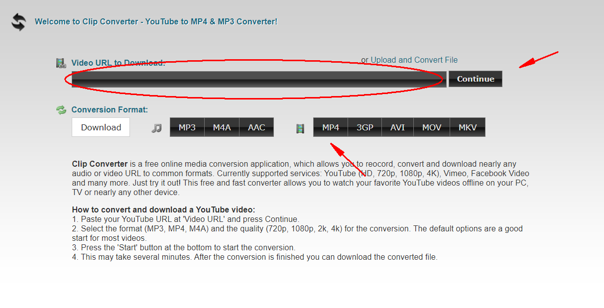

### 1. 
```text
打开这个在线网站：http://www.clipconverter.cc/
```

### 2. 
```text
进入YouTube，寻找你想要下载的视频，播放视频，然后复制地址栏的URL链接； 
```

### 3. 
粘贴复制的链接到“Video URL to Download”下面的方框里面，点击“Continue”，然后下面会弹出分辨率选项； 作者：

### 4. 
```text
选择你想要下载的分辨率和最终想要转换的格式，比如MKV、AVI、MOV，或者是MP3、M4A等音频格式等；
```

### 5. 
```text
点击“Start”按钮开始下载。 
```

### 图例
