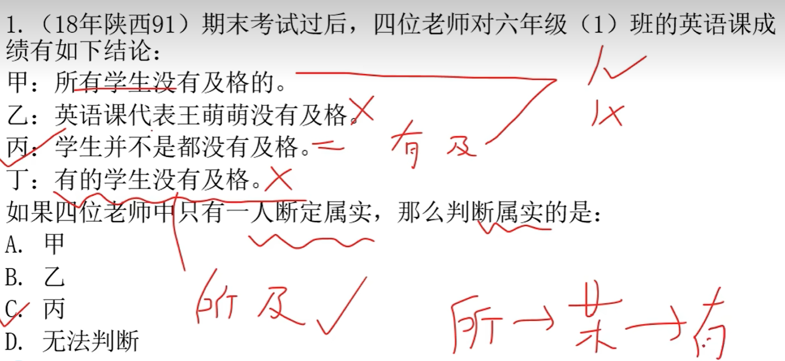
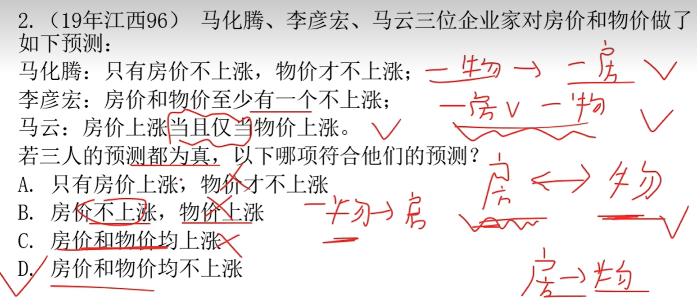
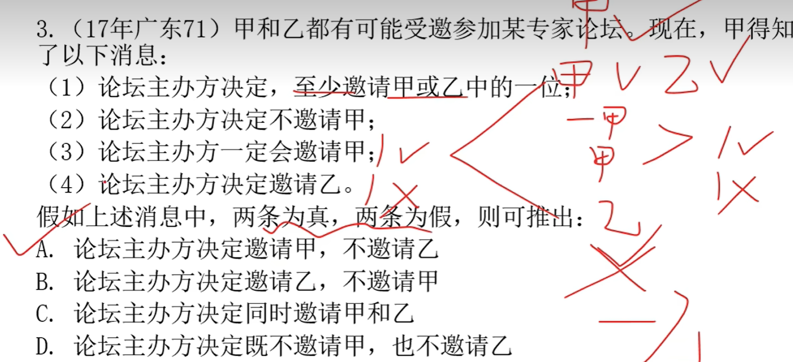
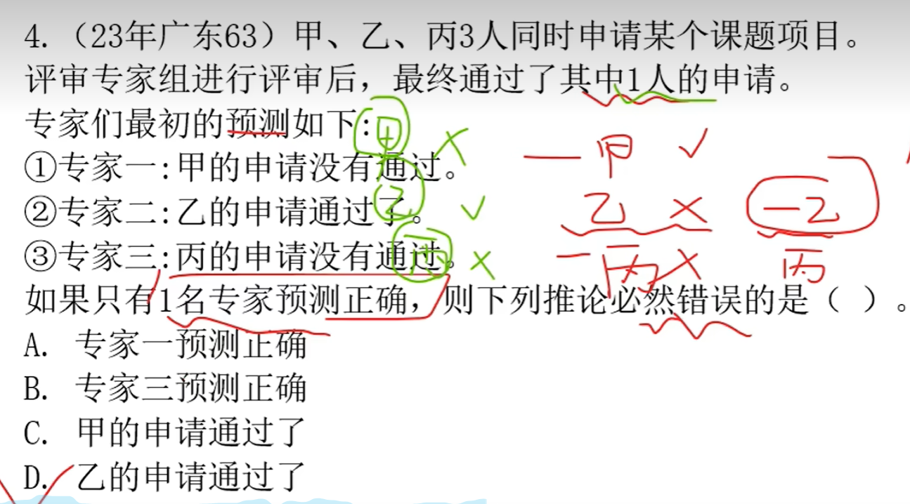
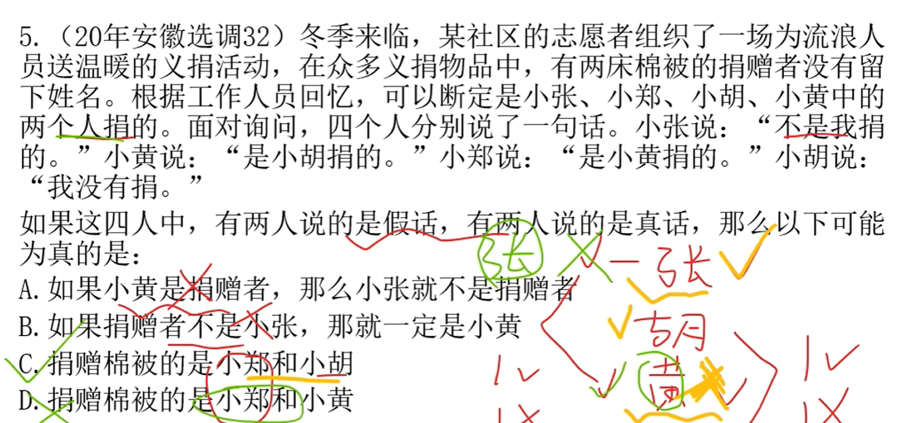
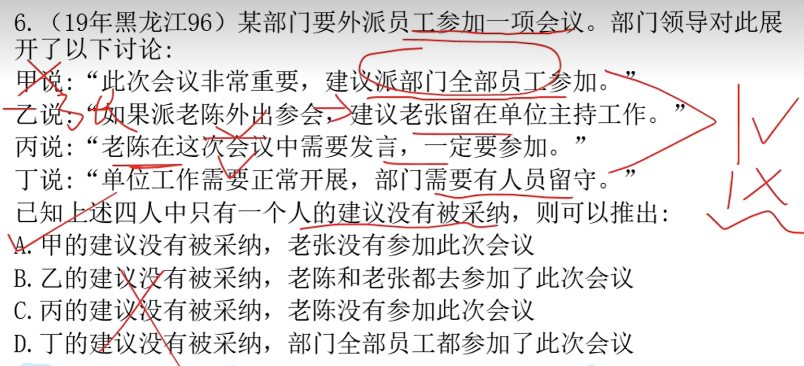
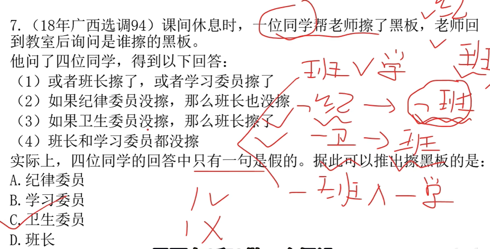
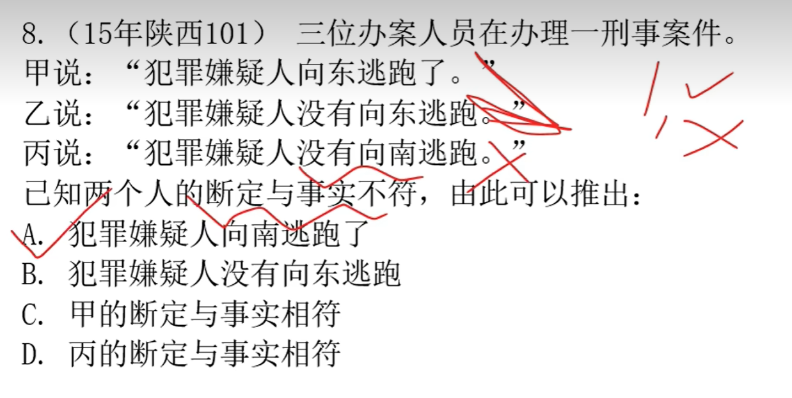
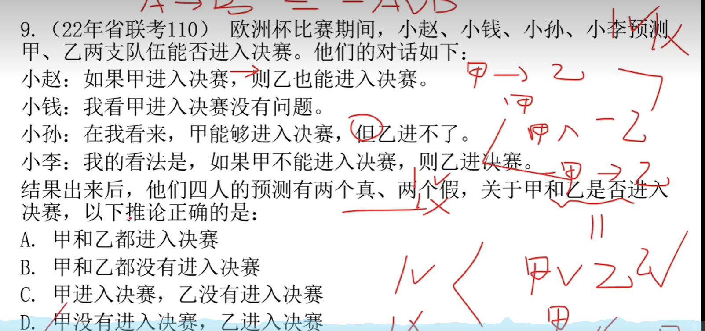

# 1

## 1.1 题目

## 1.2 理解

**甲 和 丙矛盾，说明必定有一个人是真实的**

**其它两个人说的都是假的，说明：所有学生都及格了**

**只有 丙 说对了**

# 2

## 2.1 题目

## 2.2 理解

**非物-》非房；非房 or 非物；房《-》物；**

**一个一个带入。只有 D 满足**

# 3

## 3.1 题目

## 3.2 理解

**甲 or 乙；非甲；甲；乙**

**2、3 有矛盾关系，所以必有一真一假；1、3 也一真一假**

**假设 4 且真，那么 1 也为真，所以 4 必为假**

**答案：邀请甲，不邀请乙**

# 4

## 4.1 题目

## 4.2 理解

**带入A，1 真，2 假，3 假；得出：甲没有，乙没有，丙有；可以**

**带入B，3 真，1 假，2 假；得出：丙没有，乙没有，甲有；可以**

**带入C，1 假，2 假，3 真；可以，最后得出 D**

# 5

## 5.1 题目

## 5.2 理解

**根据题目列出：非张；胡；黄；非胡**

**一个个带入，选 C **

# 6

## 6.1 题目

## 6.2 理解

**甲 和 丁 矛盾，所以必有一真一假，那么乙丙为真**

**结合乙丙推出，甲没有被采纳**

# 7

## 7.1 题目

## 7.2 理解

**根据题目：班 or 学；非纪-》非班；非卫-》班；非班 and 非学**

**1、4 矛盾，那么必有一个人是假的；根据 2 得出，班长没擦，那么卫擦了； 答案 C**

# 8

## 8.1 题目

## 8.2 理解

**根据题目：甲乙矛盾，那么必有一真一假；丙就是错的**

**那么答案A**

# 9

## 9.1 题目

## 9.2 理解

**这题关键鲁滨逊定律：非甲-》非乙 变为 甲 or 乙，那么 2、4 矛盾，答案D**