# 1

## 1.1 题目

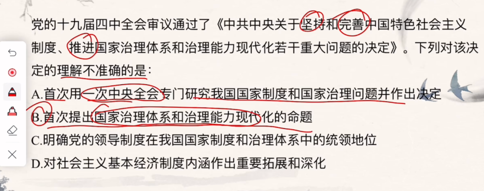

## 1.2 理解

**题目中看到：推进，说明已经不是第一次这个话题**

**答案 B 不准确**

# 2

## 2.1 题目

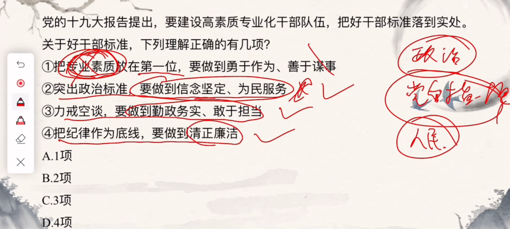

## 2.2 理解

**一般说到要 `做到xxx` 大概率是对的**

**但是 1 中前半句出现把 `xxx` 放到第一位这个东西不准确**

# 3

## 3.1 题目

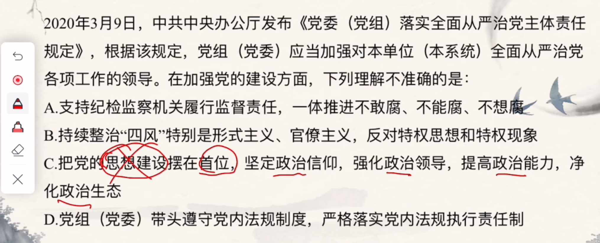

## 3.2 理解

**C 中出现 `xxx` 要在首位，这个一般都需要注意**

# 4

## 4.1 题目

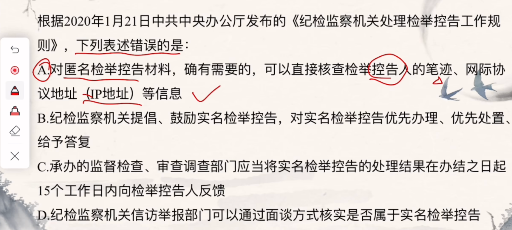

## 4.2 理解

**A 中说 `匿名检举` 会被查到个人信息，那么和 `匿名检举` 不是相违背了吗**

# 5

## 5.1 题目

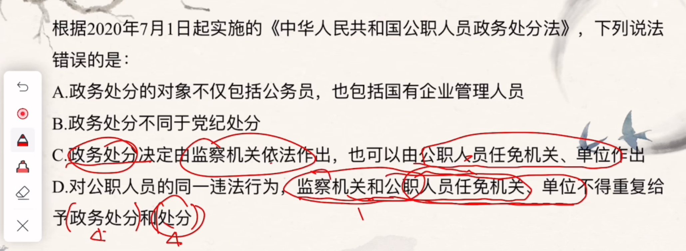

## 5.2 理解

**D 说明了，监察机关和公职人员任免机关分别可以给 政务处分和处分**

**而 C 说政务处分两个都可以，明显冲突，选择 C**

# 6

## 6.1 题目

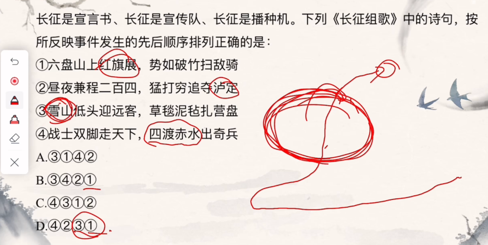

## 6.2 理解

**1 中提到红旗，有种胜利的意思，所以放在最后**

**爬雪山是快胜利之前，选择 D**

# 7

## 7.1 题目

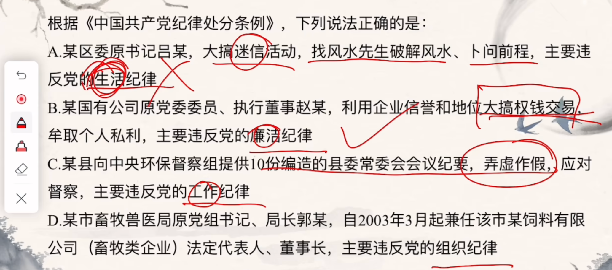

## 7.2 理解

**B 中提到贪财，说明不廉洁**

# 8

## 8.1 题目

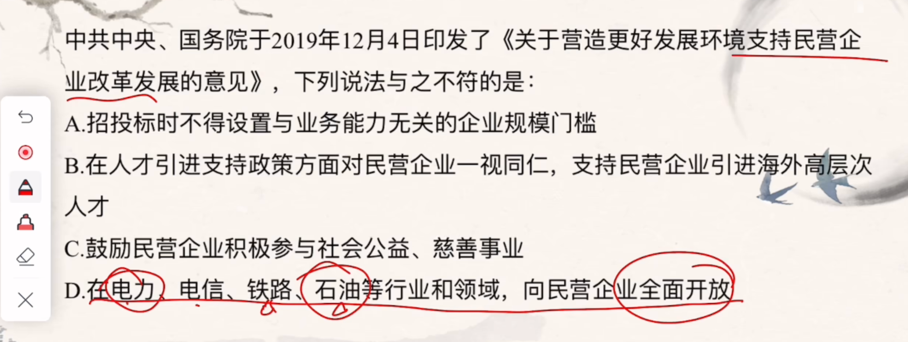

## 8.2 理解

**题目说支持民营企业，但是 D 中提到全面开放明显错误，支持肯定是有限度的**

# 9

## 9.1 题目

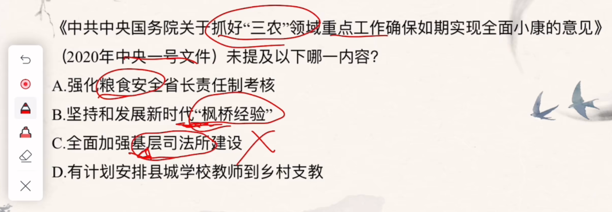

## 9.2 理解

**C 说司法所建设和三农没关系，并且基层不一定是农村**

# 10

## 10.1

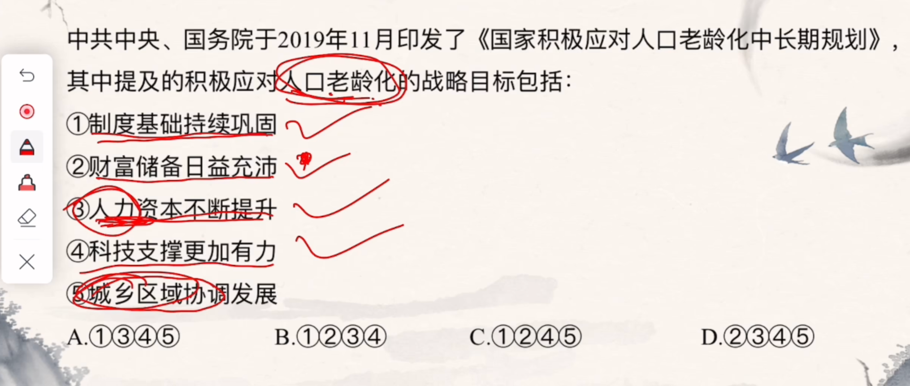

## 10.2

**1 是万金油，2 是前要足够，3 也要，答案 B**

# 11

## 11.1

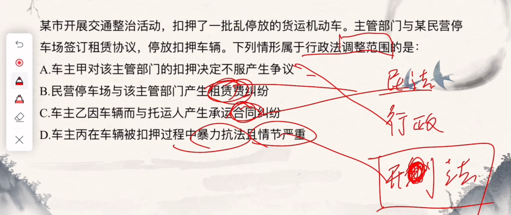

## 11.2

**暴力属于刑法，合同租赁适用于民法，答案A**

# 12

## 12.1

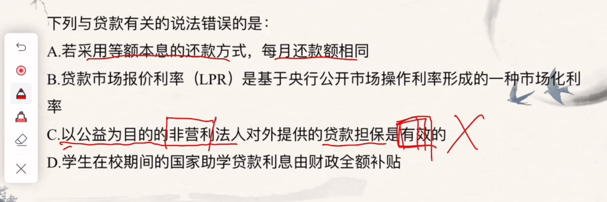

## 12.2

**C 中法人没有自己的资产，全是公益，无法担保**

## 13

## 13.1

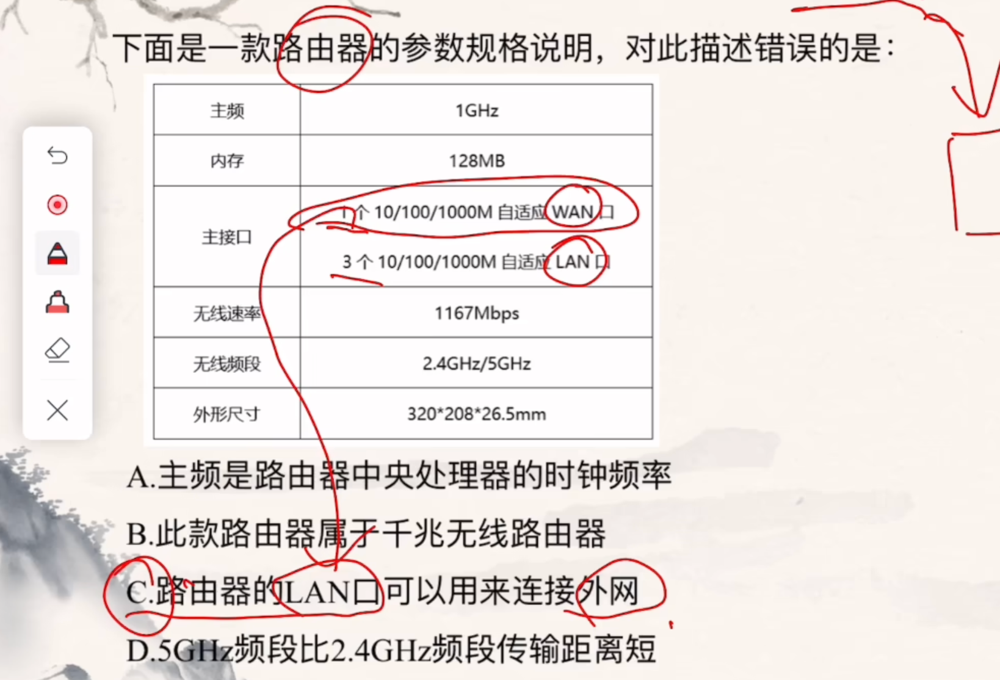

## 13.2

**Wan 是 外网**

# 14

## 14.1

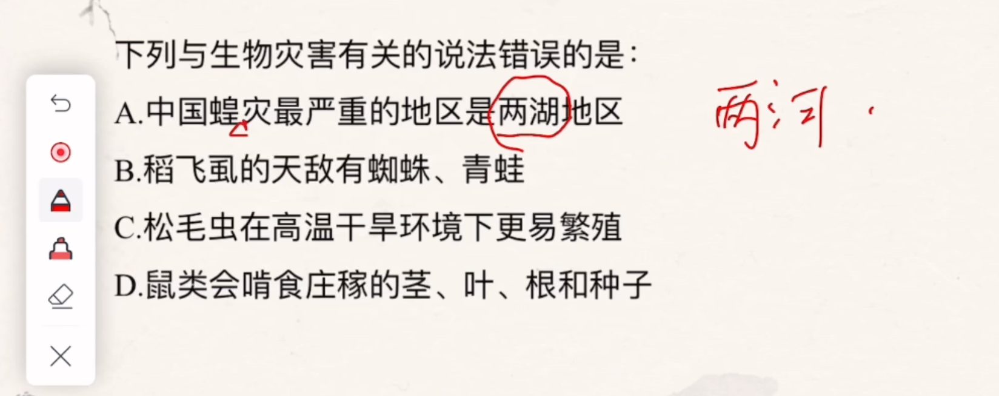

## 14.2

**`最严重`比较都是一个可天空，答案A**

# 15

## 15.1

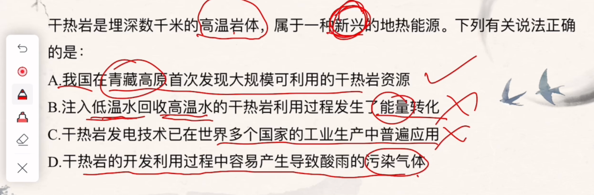

## 15.2

**新兴能源绿色，那么 A 很有可能对**

**B说能量转换，低温到高温并没有，新发现C错误，绿色 D错误**