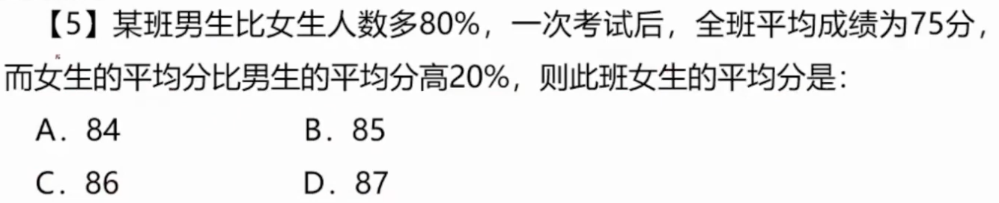
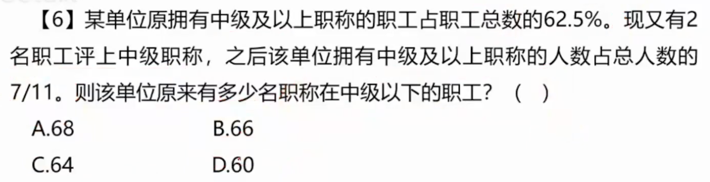
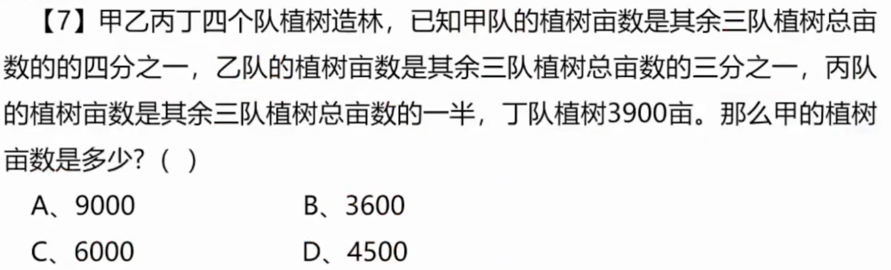
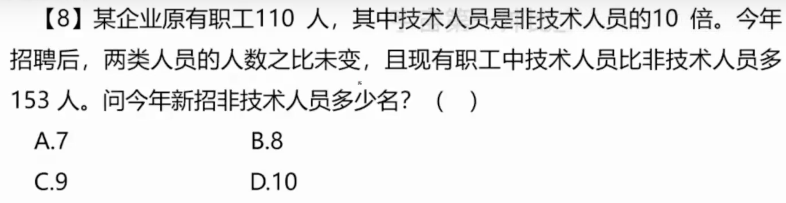
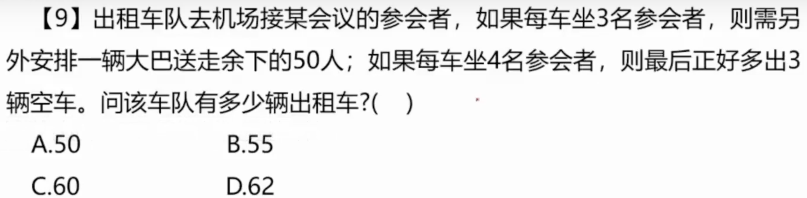
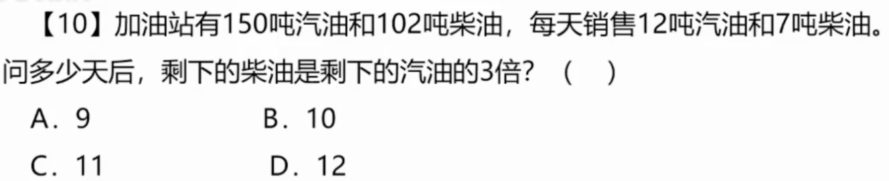

# 1

## 1.1 题目

## 1.2 解法

**注意到：公司将车辆平均分成数量的两队，那么车辆数必定为偶数**

**那么 `轿车` 和 `面包车` 都是偶数，相减也必定是`偶数`，排除 A、C**

**设轿车为 4x，面包车为 7y， 即 4x + 7y = 79**

**并且 x - y = ?，符号 `?` 可油选项替代，解得 B 选项可整除，即为答案**

# 2

## 2.1 题目

## 2.2 解法

**相连的三个整数平均值必为中间数字，即 7 + 8 + 9 = 8 * 3**

**也必为 3 的倍数，即 n + (n + 1) + (n + 2) = 3n + 3**

**那么6个相连的整数必为 3 的倍数，可得 C 为三的倍数，即为答案**

# 3

## 3.1 题目

## 3.2 解法

**每天生产 100 个，那么假设 x 天，即为 100x 个。排除 A、D 不是 100 倍数**

**提高后每天生产 120，使用 x - 4 天完成任务，即为 120(x - 4) 个**

**方程组：120(x - 4) = 100x + 80，看出规律答案必须为 100 和 120 的倍数**

**解得答案 C，也可使用方程组化简。答案一样。**

# 4

## 4.1 题目

## 4.2 解法

**题目中说：选了 `1/11` 的男员工，可得男员工数量必须为 11 的倍数，排除 A、C**

**接下来使用代入法：使用 B=99 带入，可得 男员工 = 99，女员工 = 57**

**男员工：99 - 1/11 = 90，女员工：57 - 12 = 45，即得出 男 = 2倍女**

**得出答案 B，题目重点需要关注男员工的倍数问题**

# 5

## 5.1 题目

## 5.2 解法

**题目说：女生平均分比男生多 20%，那么我们可以知道：总分 = 0.6女生平均分 + 0.4男生平均分**

**巧妙解法：那么女生的平均分必定是 6 的倍数，排除 B、C、D，选出答案 A**

**方程解法：假设女生人数为 x，那么男生人数为 1.8x，总人数为 x + 1.8x**

**假设男生平均分为 y，那么女生平均分为 1.2y，总分 = y * 1.8x + 1.2y * x**

**使用总分数 / 总人数 = 75，即可求出答案 A**

# 6

## 6.1 题目

## 6.2 解法

**题目说：原中级及以上职工占 62.5%，即 5/8，也就是说，中级以下人数为 3(剩余3/8) 的倍数**

**由上面的结论排除 A、C 选项**

**有 2 人评上中级职称，现在比例为 7/11，也就是说，中级以下人数 - 2 = 4 的倍数**

**带入选项 B，得出答案**

# 7

## 7.1 题目

## 7.2 解法

**题目说：甲是其余 3 队的四分之一，说明甲占总数的 1/5**

**同理可得：乙占总数 1/4，丙占总数 1/3**

**得出丁占 13/60 = 3900，可得甲为 12/60 = 3600**

# 8

## 8.1 题目

## 8.2 解法

**题目说：技术是非技术的 10 倍，既技术为 100 人，非技术 10 人**

**现在招牌之后，技术比非技术多了 153 人，即 10x - x = 153**

**得出 x = 17，即非技术有 17 人，减去未招聘时的 10 人，结果为 7 人**

# 9

## 9.1 题目

## 9.2 解法

**题目说：没车坐 3 人还剩下 50，每车坐 4 人还多出 3辆车**

**设有 x 辆车，即：3x + 50 = 4(x - 3)**

**解得 x = 62，答案为 D**

# 10 

## 10.1 题目

## 10.2 解法

**和上题思路差不多，设第 x 天柴油为汽油的 3 倍**

**方程：3(150 - 12x) = 120 - 7x，解得 x = 12，答案为 D**
