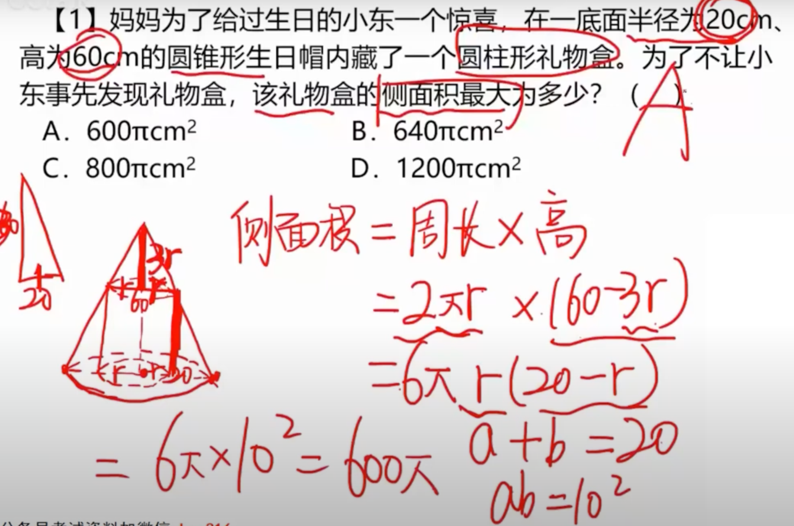
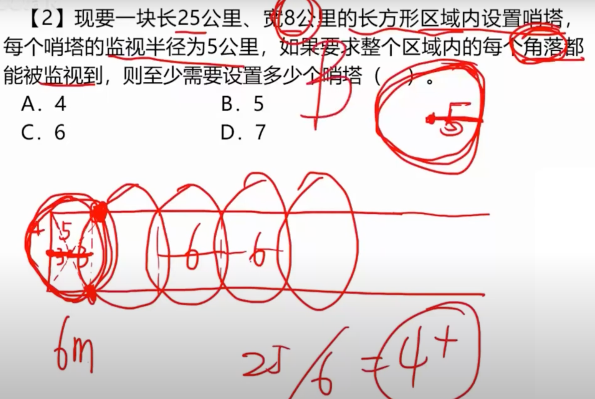
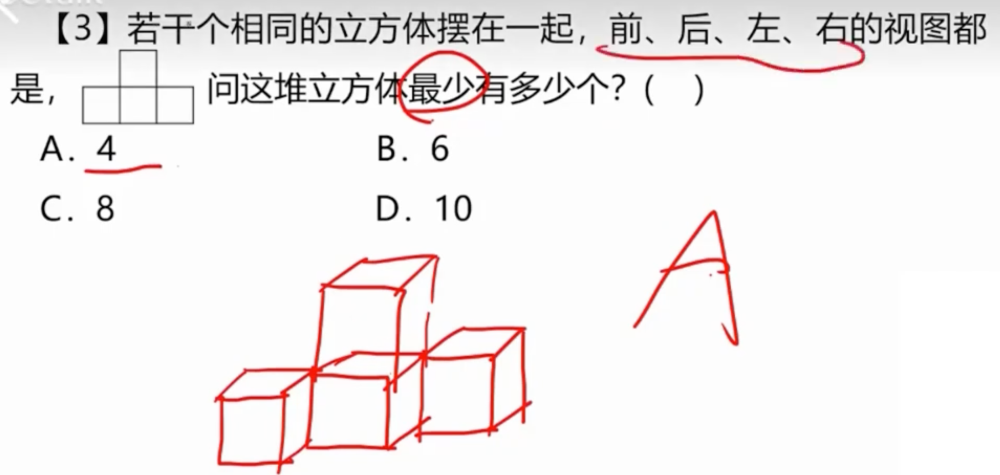
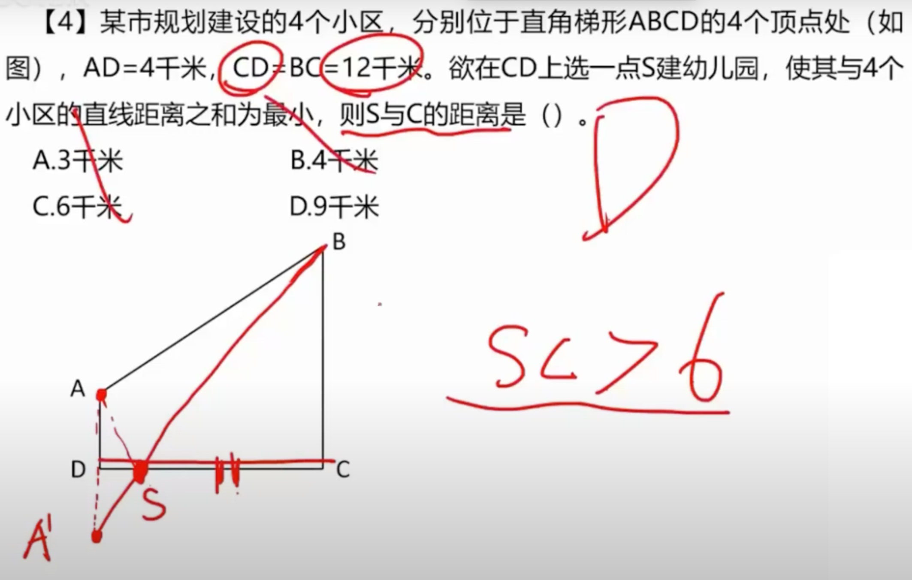
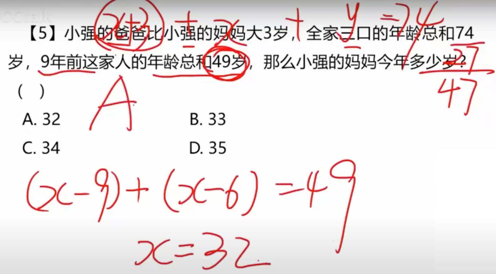
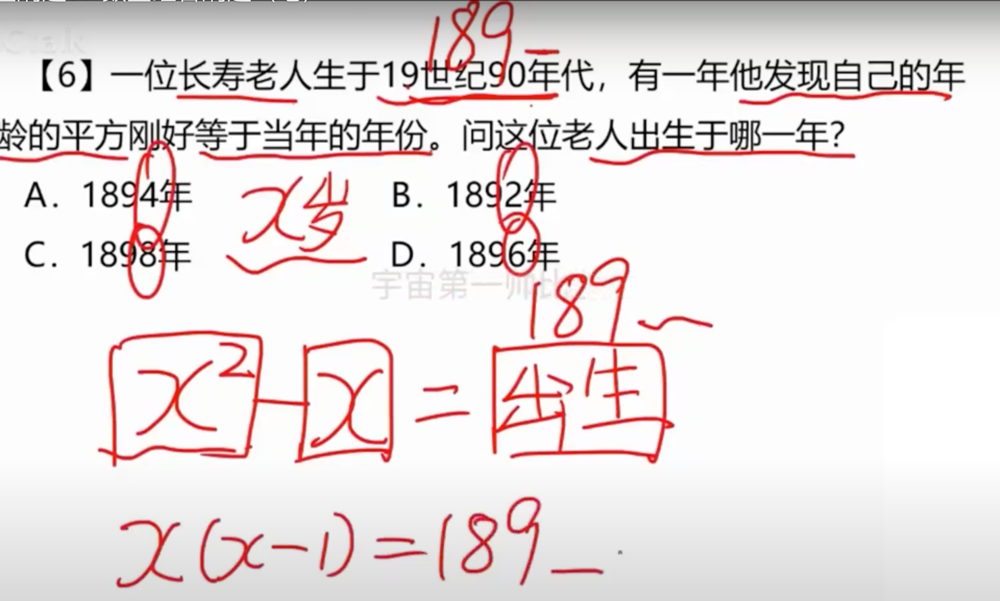
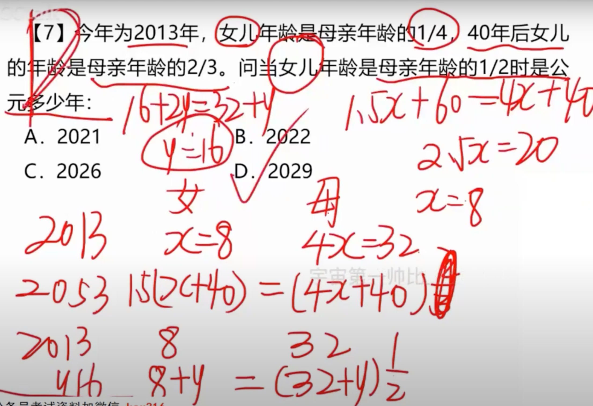
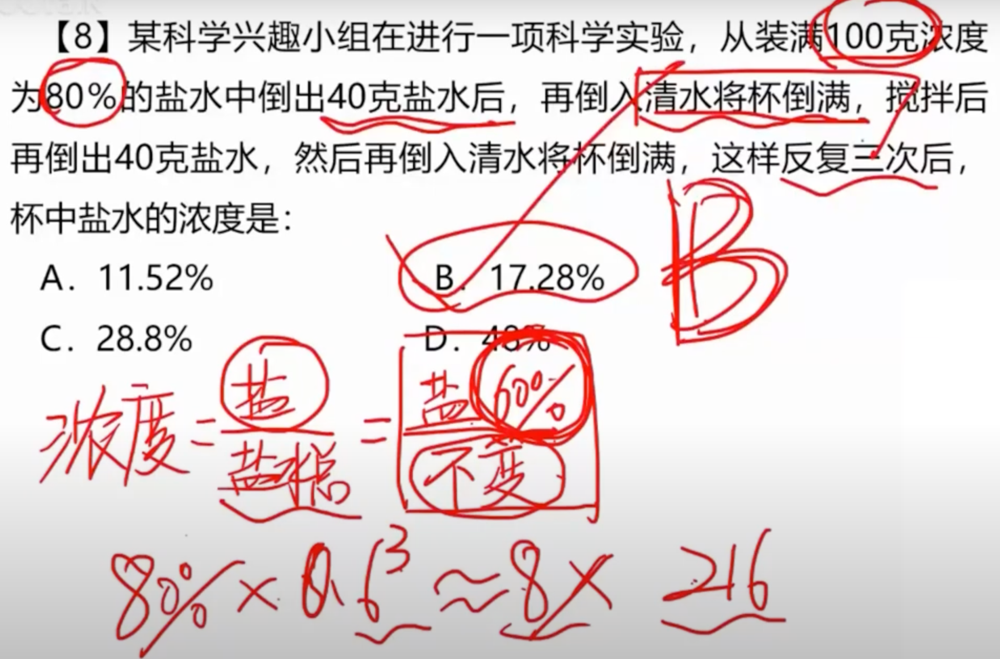
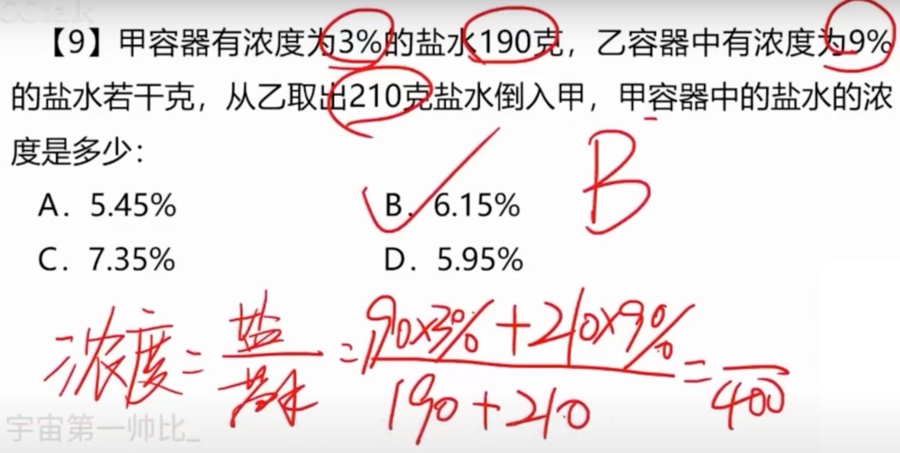
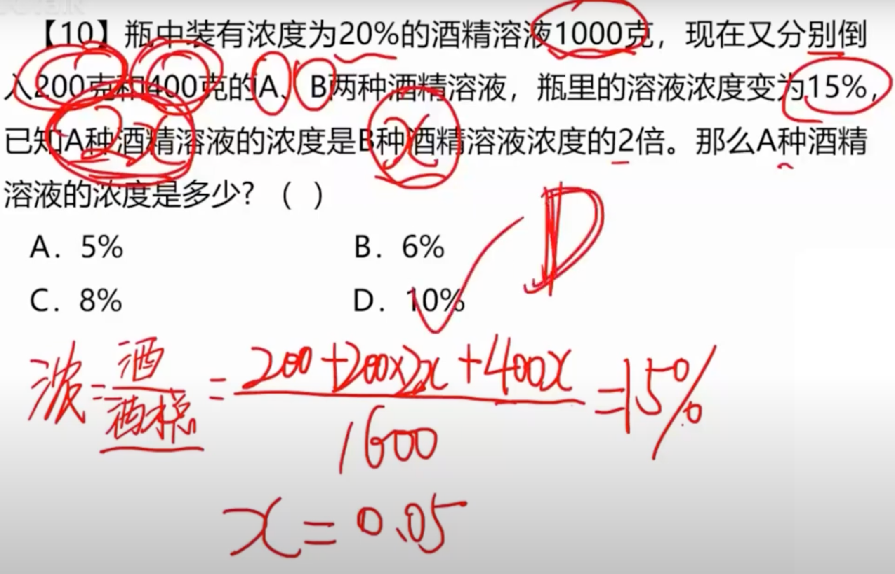

# 1

## 1.1 题目

## 1.2 解法

****

# 2

## 2.1 题目

## 2.2 解法

# 3

## 3.1 题目

## 3.2 解法

**如上图，最少只需要 4 个**

# 4

## 4.1 题目

## 4.2 解法

# 5

## 5.1 题目

## 5.2 解法

**根据题目：设妈妈为 x，那么爸爸为 x + 3，设总和为 x + x + 3 + y = 74**

**九年前为 49，但是 74 - 27 = 47，说明九年前小强还没出生**

**那么妈妈等于 (x - 9) + 爸爸等于 (x - 6) = 49 = 32，答案 A**

# 6

## 6.1 题目

## 6.2 解法

**也就是当前的岁数^2 - 当前岁数 = 出生年份**

**x^2 - 2 = 年份；x(x - 1) = xxxx，带入答案 B**

# 7

## 7.1 题目

## 7.2 解法

**2013年，女儿 x，母亲 4x**

**40 年后：女儿 x + 40，母亲 4x + 40**

**女儿为母亲2/3，那么 1.5(x + 40) = (4x + 40)，解得 x = 8**

**也就是说 2013 年女儿 8 岁，目前 32 岁**

**两倍：2(y + 8) = (32 + y)，解得 y 等于 16 年后，答案 D**

# 8

## 8.1 题目

## 8.2 解法

**每一次操作都会把当前的浓度变为 60%，那么操作三次就是 60% 的立方**

# 9

## 9.1 题目

## 9.2 解法

**浓度 / 总量**

# 10

## 10.1 题目

## 10.2 解法

**看图不多逼逼**