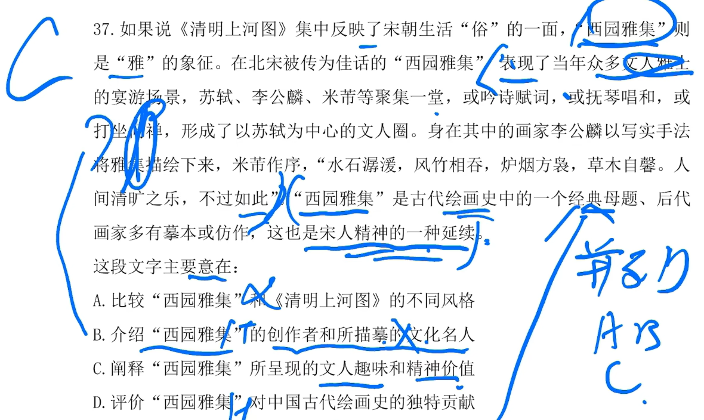

# 1

## 1.1 题目

## 1.2 理解

**第 1 句说：虚拟空间更进一步；而第 2 句说：虚拟空间在局部战争中的作用**

**第 2 句总结性应该在第 1 句之后；排除 A、C**

**再看第 4 句，时间在第 1 句之前，那么 4 要在 1 之前；排除 B，答案 D**

# 2

## 2.1 题目

## 2.2 理解

**文段一开始说：跌跌撞撞，紧接着举例子，最后说创作者在努力**

**所以横线处应该表达积极的一面，排除 A、B、D，答案 C**

# 3

## 3.1 题目

## 3.2 理解

**文段开头是哦：锂离子在新能源汽车很重要；接着说：寻找一种更好的材料，让其成为下一代储能技术**

**最后说：找到了钠离子；可以得出就是为了引出锂离子。**

**A、C、D 都在胡扯，B正确**

# 4

## 4.1 题目

## 4.2 理解

**题目开头说：云观展很流行，但是还是不如线下实物看**

**后面就是对实物观看进行分析，没必要看**

**答案A**

# 5

## 5.1 题目

## 5.2 理解

**题目先说：古代怎么传播，现代怎么传播。最后引入剪纸扮演重要角色**

**那明显前面的传播就是为了 `剪纸` 做铺垫，答案选 D**

# 6

## 6.1 题目

## 6.2 理解

**题目先说：线上教育更加依赖教师，但是也让每一个人都可以成为教师这样的角色**

**紧接着引入 需要社会力量和在线教育资源 加入；不再是学校一个人的事情了，说到底就是为了让更多人参与进来**

**后面就是举例子，没必要看；答案 D**

# 7

## 7.1 题目

## 7.2 理解

**题目先说：农民个人入股合作社感觉`地位不保`；**

**紧接着说：要解决这种情况需要`集体经济组织`出面；后面就是举例子，说这个怎么怎么厉害**

**所以总结一下，就是说`集体经济组织`牛逼，答案 D**

# 7

## 7.1 题目

## 7.2 理解

**题目一开始说：密切关系怎么这么牛逼**

**看横线：`这意味着` 表示横线处需要填入前面相关的东西；后面 `进一步表明` 说明和原子钟有关系；**

**只有 A 合适**

# 8

## 8.1 题目

## 8.2 理解

**题目先说：外国的综艺节目怎么怎么牛逼**

**然后说：还是需要研究自己的文化，并且创新起来；再接着之后就是举例子，本地文化牛逼**

**所以推出我们应该要学会本土文化创新，答案 B**

# 9

## 9.1 题目

## 9.2 理解

**题目中出现：这也而说明了 就是对前面一大串的解释**

**后面提到：社会治理重要、各种培育；**

**就是说明：培育好、培育棒、培育顶呱呱；答案 B**

# 10

## 10.1 题目

## 10.2 理解

**题目先说：在工作中没什么地位无法维权，使用网络**

**又说：使用网络会发一些乱七八糟的东西，出现乱搞现象**

**本质上就是说：使用网络发布不要乱说，要先理一理；而只要合理使用就不会和法律发生关系，排除 D**

**答案 C**

# 11
## 11.1 题目

## 11.2 理解

**题目说：城市中的每个环节都很重要，会牵一发而动全身，容易引发系统性问题**

**然后说：各部门之间怎么怎么努力合作非常重要**

**还举例子说不合作会怎么样**

**一看就是再说需要合作，和做好，就要合作，答案 B**

# 12

## 12.1 题目

## 12.2 理解

**题目先说：缺水，非常缺水，海水淡化就非常好**

**紧接着说：举例子，我国海水特别多，我们也有技术，但是技术还不够，需要提升**

**这一看就是说：海水淡化很好，但是我们技术不够，需要加强；答案 B**

# 13

## 13.1 题目

## 13.2 理解

**题目先说：科学媒体可以人大众了解科学，但是经过媒体宣传高了一些虚头八脑的**

**所以我认为的答案是 D；但是网上说粉笔是 B**

# 14

## 14.1 题目

## 14.2 理解

**题目先说：机构宣传称干细胞治疗牛逼坏了，但是专家说很一般，甚至有风险**

**然后举个例子没必要看，最后又说了一遍有风险**

**总结一下：就是不管你现在多牛逼，就是存在风险；答案 B**

# 15

## 15.1 题目

## 15.2 理解

**题目说：文学创作怎么怎么好，就是牛逼**

**紧接着说：部分小说缺乏正能量，应该要正能量**

**总结：这明显就是在说写小说不要负能量**

# 16

## 16.1 题目

## 16.2 理解

**第 2 句说明问题，第 3 句举例子，3 一定要在 2 前面**

**第 5 句将对策，第 6 句说明某个地方的问题；6 一定要在 5 前面**

**过滤出答案 C**

# 17

## 17.1 题目

## 17.2 理解

**题目说：种树可以保护水源，但是人工种树有问题，还举了个例子说明人工树有问题**

**所以得出：要保护好原生自然的树，因为比较自然**

# 18

## 18.1 题目

## 18.2 理解

**题目横线后面说：读书不能死读书，要思考**

**那前面肯定和他相对应，要辩证的读书；答案 B**

# 19

## 19.1 题目

## 19.2 理解

**题目说：地球自转会影响时间精确度，有些东西非常依赖精确度，不能乱搞**

**这个时候，科学家出手了，他调整了时间，但是他没说用什么调整的**

**那么接下里非常有可能说：科学家用什么搞的那么准确；答案 B**

# 20

## 20.1 题目

## 20.2 理解

**题目说：古代开车很有道德，这非常好。但是现在汽车越来越多，需要提升素质**

**总结：大概就是说现在开车没素质；答案 A**

# 21

## 21.1 题目

## 21.2 理解

**题目说：两种图画，但是后面一直在说后面一种图画牛逼坏了**

**最后说了一下传承了精神；选项 A 纯属乱讲**

**总结：这个图画传承的精神影响很大；答案 C**

# 22

## 22.1 题目

## 22.2 理解

**题目说：要畅通国内经济大循环，可以采取数字贸易**

**又说：数字贸易国内牛逼，国外也牛逼，还促进了经济循环**

**总结：整篇都在跨数字贸易好，达到促进大循环；答案 C**

## 23

## 23.1 题目

## 23.2 理解

**题目说：有几种天然气，碳越多氢也多，碳多需要温度也高；**

**之后说：距离甲烷温度 50 就可以生产，温度越高越难**

**总结：技巧体。A、B并列直接排除，甲烷需要温度最低，所以最多，答案 C**

# 24

## 24.1 题目

## 24.2 理解

**题目说：知识产权法律是什么样的，之后再说它和他别人不同，它的功能怎么怎么牛逼**

**总结：先说定义，后说功能；答案 D**

# 25

## 25.1 题目

## 25.2 理解

**题目中，横线前面出现：单一、特定的造型**

**横线上要填的是和它具有相反意思的，答案 B，不断运动之中**

# 26

## 26.1 题目

## 26.2 理解

**题目先说：各种体育器材健全了，但是维护的很辣鸡；所以希望服务管理跟上**

**总结：就是器材有了，也要维护，不要啥也不管；答案 B**

# 27

## 27.1 题目

## 27.2 理解

**题目说：法律很重要、道德很重要；**

**紧接着：现代法律需要道德，有了道德才能牛逼，并且一直只夸道德**

**总结：道德对于法律来说非常之重要；答案 A**

# 28

## 28.1 题目

## 28.2 理解

**题目说：先提到咖啡因让蜜蜂专一；再说实际的操作迷的蜜蜂找不着北**

**总结：都在说这个东西为什么对蜜蜂的影响；答案 C**

# 29

## 29.1 题目

## 29.2 理解

**题目说：有很多残缺的东西是美丽的，怎么说？**

**后面一大堆废话不用看，答案 B；C选项有点片面**

# 30

## 30.1 题目

## 30.2 理解

**题目说：卖书搞的花里胡哨，不接地气；甚至改名字来卖书**

**接着说：希望多一点真诚，不要搞一些虚头巴脑的名字**

**答案 C,**