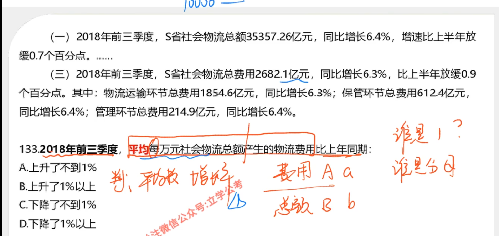

# 1

**读题：2018 比 2010**

**平均，那么肯定是 `总数/数量` 的比值**

# 2

**2011 ~ 2018 总共 8 * 12 = 96 个月**

**那么用 `总时间 / 数量 = 每一个时间`**

# 3

**同比：今年和去年比**

**超过 10%，大概算一下就行了**

# 4

**先用收入相减，得到多出来的部分**

**之后再除以人数，就获得没人平均值。**

# 5

**这题是说，俄罗斯、美国，分别占全国比重的差值**

**可以用 俄罗斯/全部 - 美国/全部，也可以先 (俄罗斯 - 美国) / 全部**

# 6

**求基期的比重差，都需要和总量相比**

**可以进行总量预估，要不然算起来太麻烦**

# 7

**像这样的题目，一般可以先高位相加**

# 8 部分增长站总体增长

**可以直接用增长率相处，和自生数量的关系**

# 9

**部分增长率高于总体增长率**

# 10

**两个东西增长率比较**

# 11

**这题占整体比重，快速方法可以使用除法**

**这是同样类型的**