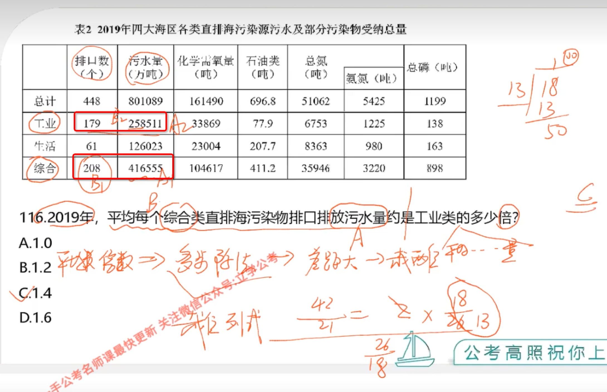
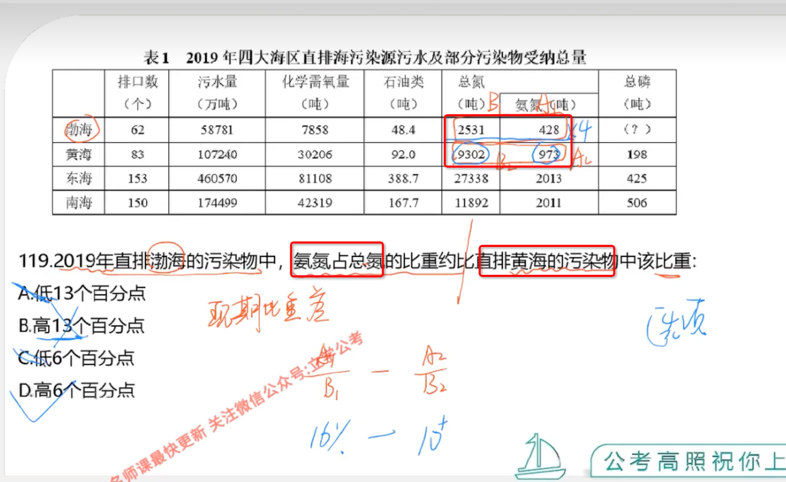

# 1

**这题一开始我没找到数据，找到之后用总数 - 其他部分**

# 2

**一开始想法错了，想用每一个数字做对比，但是发现有点难算**

**发现还是需要先自己算，再和别人比**

**下面这题类似，还是需要快速找到数据**

# 3

**这题一开始没看懂题目，没搞懂在和谁比**

# 4

# 5 求基期比重

**这题没有图，大概描述一下**

**部分增长，全量增长、减少，那么可以使用 部分 / 全量 乘以 相减之后的比例，例如 1.1 **