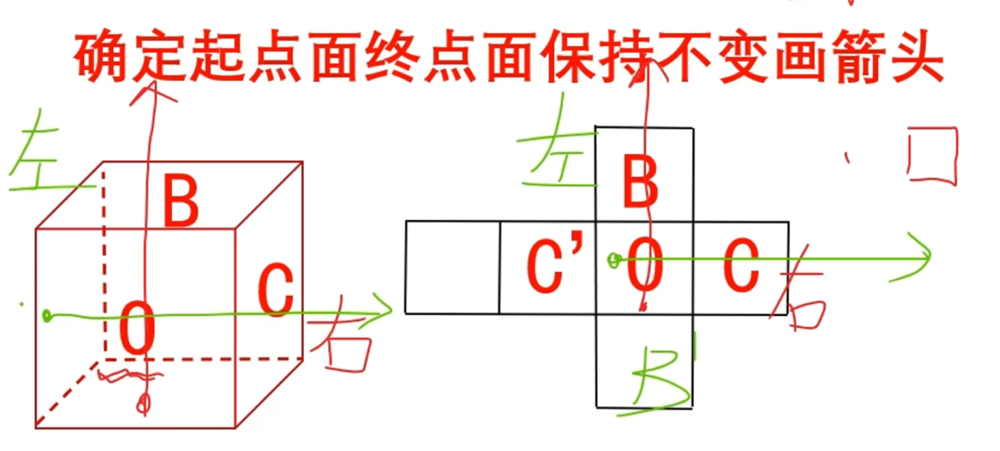
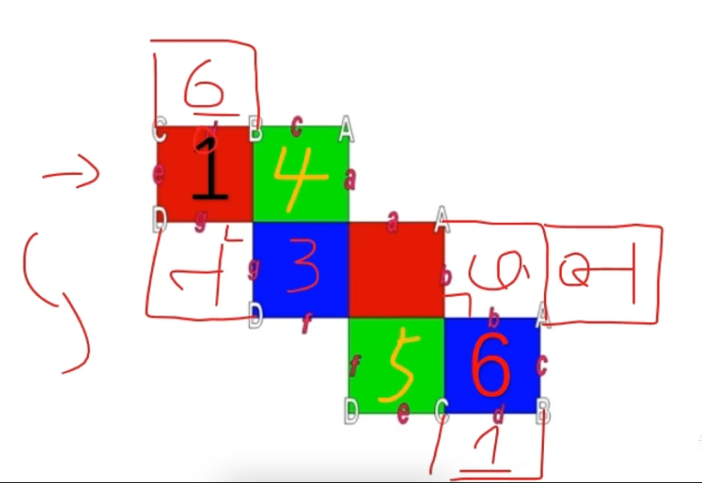
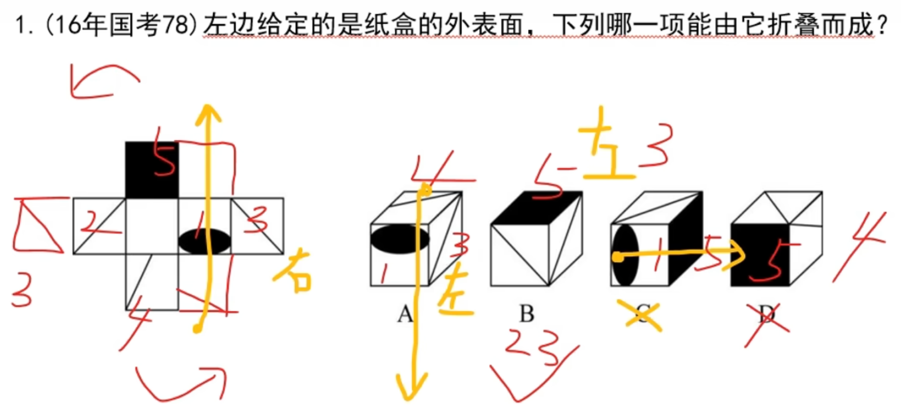
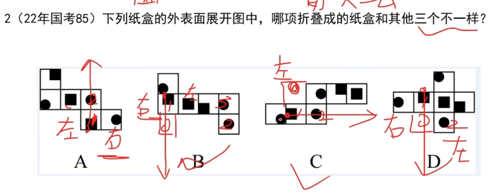
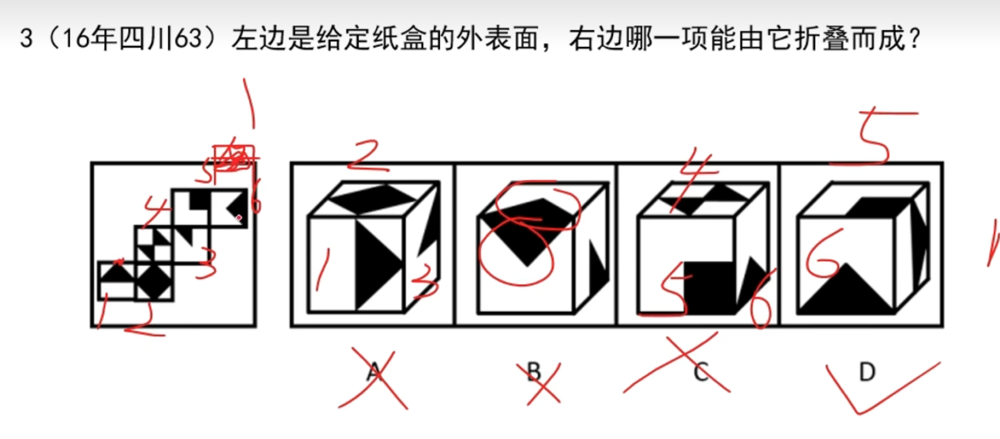
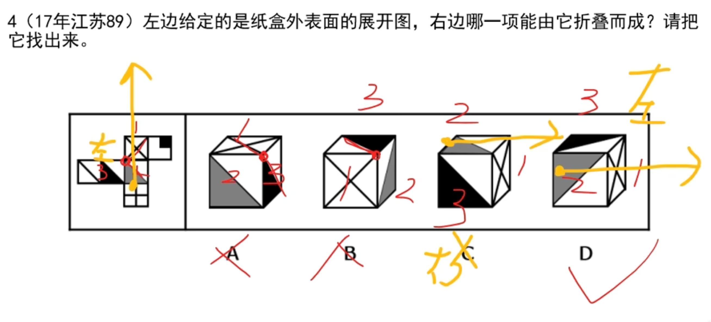
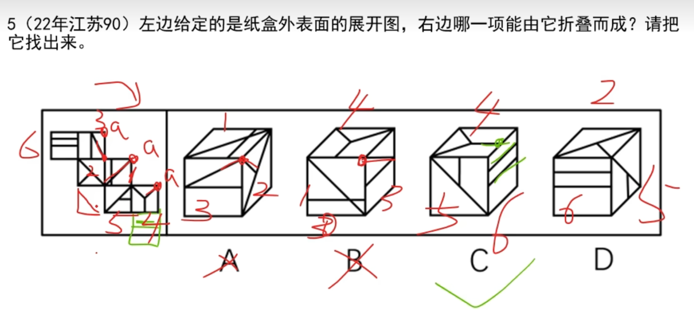
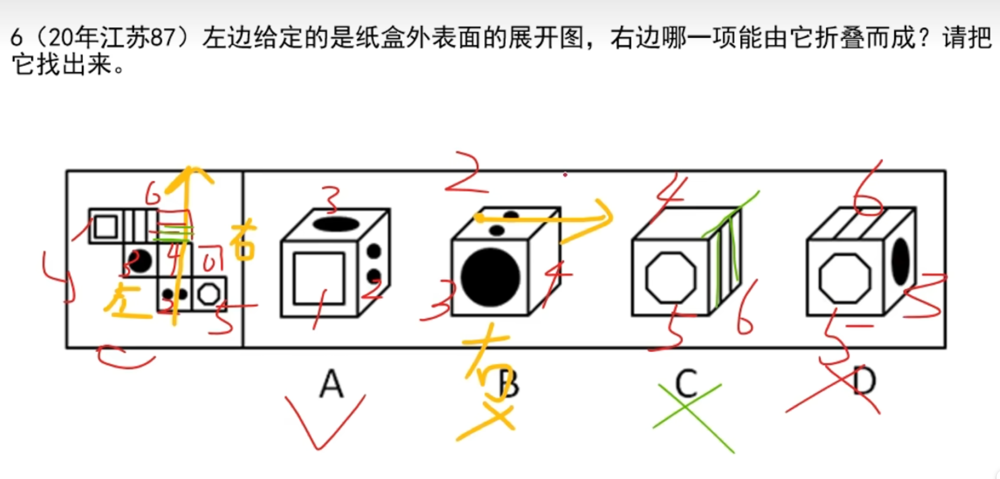

# 1. 剪头法

**从图中可以看出，`C`面都在`O`面的右边**

# 2. 六面体展开图

**这种特殊的展开图，可以直接拼接 1、6，6、1**

# 例题

## 1.1 

**第一个：箭头法**

**第三个：箭头法**

**第四个：相对面**

## 1.2

**两种方法：相对面、箭头法。这一题使用：箭头法**

## 1.3

**本地使用相对面即可排除**

## 1.4 

**第一、二个使用：公共点排除**

**第三个使用：箭头法**

## 1.5 

**第一个使用：公共点**

**第二个使用：公共边**

**第三个使用：公共边**

## 1.6

**第二个使用：箭头法**

**第三个实用：公共边**

**第四个：相对面**