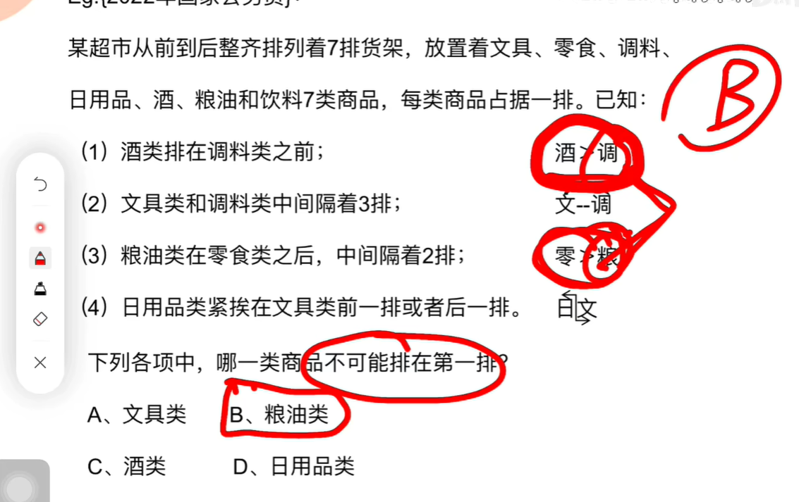
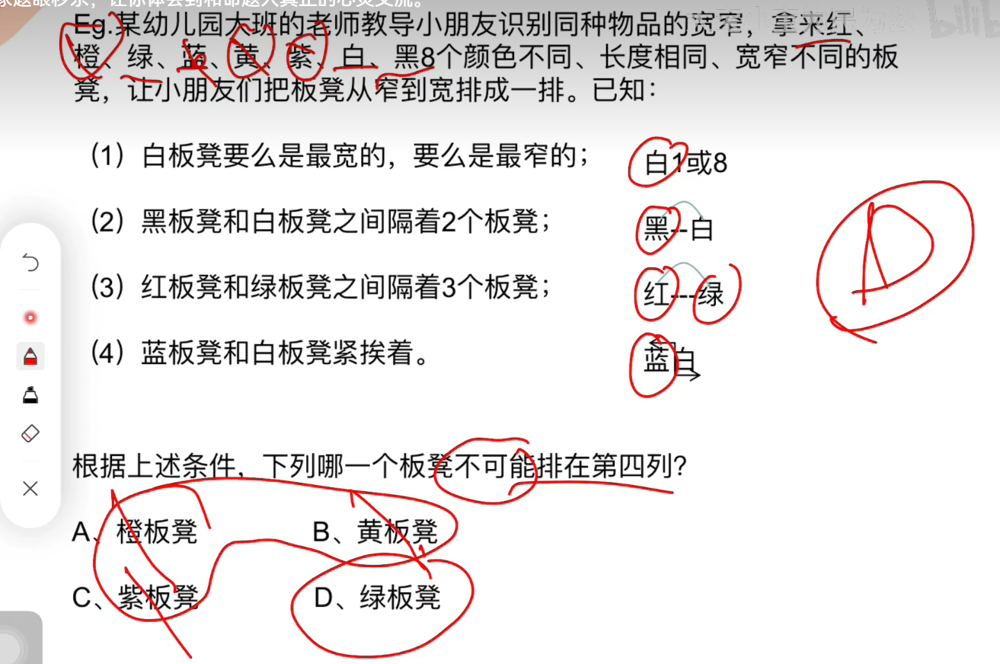
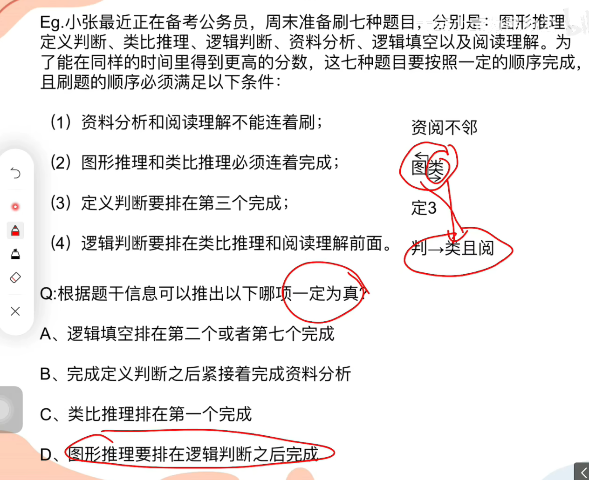
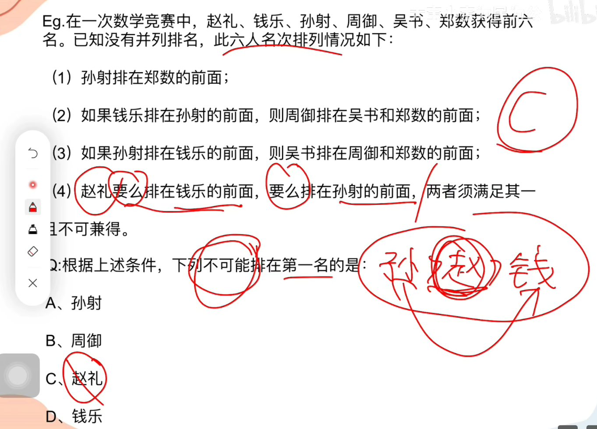
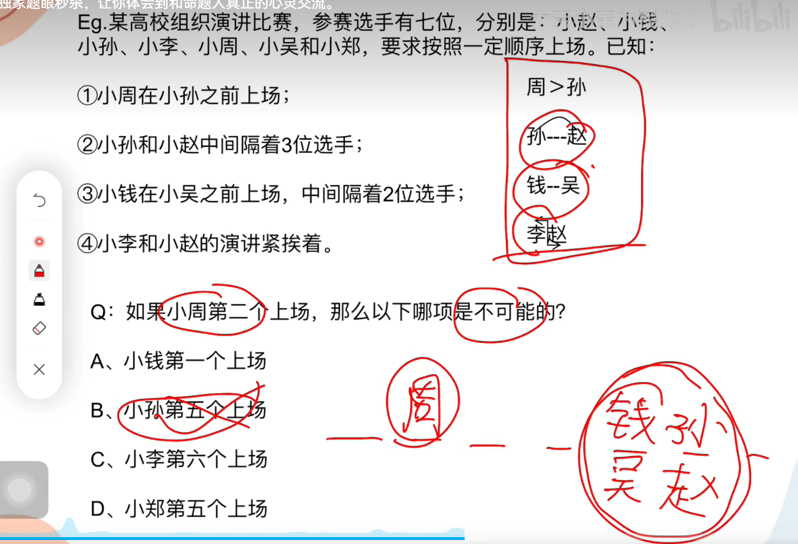

# 1

## 1.1 题目

## 1.2 理解

**`酒类` 在 `调料` 之前，那么调料必定不是第一个**

**`粮油` 在 零食 之后，那么粮油必定不是第一个**

# 2

## 2.1 题目

## 2.2 理解

**读题：白1 or 白8；黑__白；红___绿;蓝白**

**读完发现，橙、黄、紫 完全没有出现，那么这三个是等价的，不能出现在肯定中**

**所以排除 A、B、C，答案 D**

# 3

## 3.1 题目

## 3.2 理解

**捆绑类型，并且依赖一个顺序类型**

**那么库邦不可能是第一，依赖不可能是最后**

# 4

## 4.1 题目

## 4.2 理解

**要么 ... ，要么 ...**

**可以推出：赵礼 一定在 钱乐、孙射 的中间，那么他一定不可能是第一或者最后**

# 5

## 5.1 题目

## 5.2 理解

**看图，那种有固定位置的可以进行排除**

# 6

## 6.1 题目

## 6.2 理解

**总共七个位置，但是有两个大间隔**