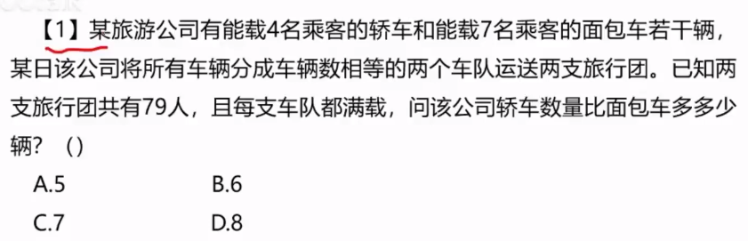
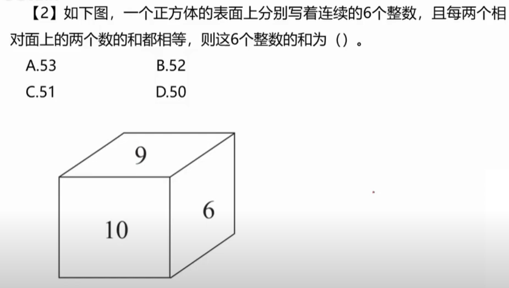
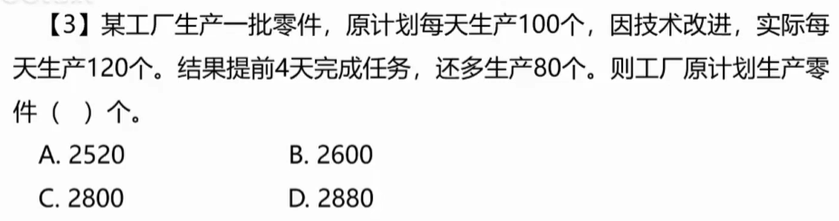
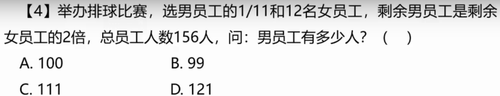

# 1

## 1.1 题目

## 1.2 解法

**注意到：公司将车辆平均分成数量的两队，那么车辆数必定为偶数**

**那么 `轿车` 和 `面包车` 都是偶数，相减也必定是`偶数`，排除 A、C**

**设轿车为 4x，面包车为 7y， 即 4x + 7y = 79**

**并且 x - y = ?，符号 `?` 可油选项替代，解得 B 选项可整除，即为答案**

# 2

## 2.1 题目

## 2.2 解法

**相连的三个整数平均值必为中间数字，即 7 + 8 + 9 = 8 * 3**

**也必为 3 的倍数，即 n + (n + 1) + (n + 2) = 3n + 3**

**那么6个相连的整数必为 3 的倍数，可得 C 为三的倍数，即为答案**

# 3

## 3.1 题目

## 3.2 解法

**每天生产 100 个，那么假设 x 天，即为 100x 个。排除 A、D 不是 100 倍数**

**提高后每天生产 120，使用 x - 4 天完成任务，即为 120(x - 4) 个**

**方程组：120(x - 4) = 100x + 80，看出规律答案必须为 100 和 120 的倍数**

**解得答案 C，也可使用方程组化简。答案一样。**

# 4

## 4.1 题目

## 4.2 解法

**题目中说：选了 `1/11` 的男员工，可得男员工数量必须为 11 的倍数，排除 A、C**

**接下来使用代入法：使用 B=99 带入，可得 男员工 = 99，女员工 = 57**

**男员工：99 - 1/11 = 90，女员工：57 - 12 = 45，即得出 男 = 2倍女**

**得出答案 B，题目重点需要关注男员工的倍数问题**