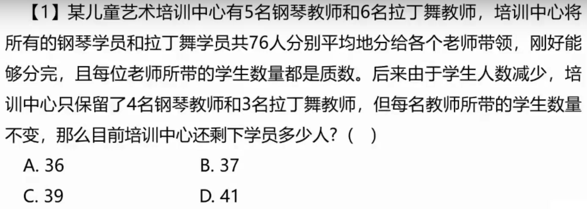
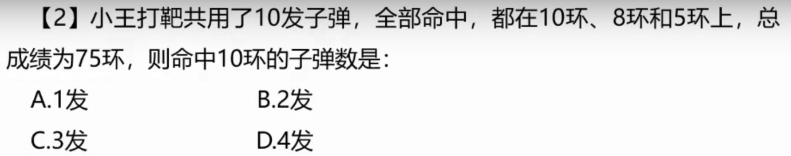
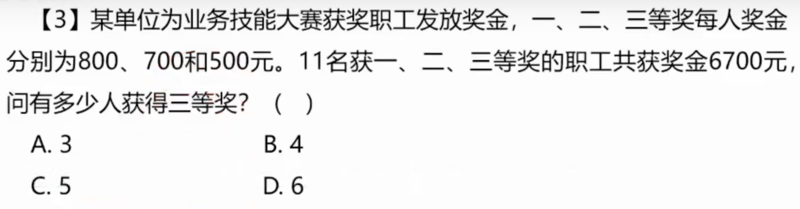
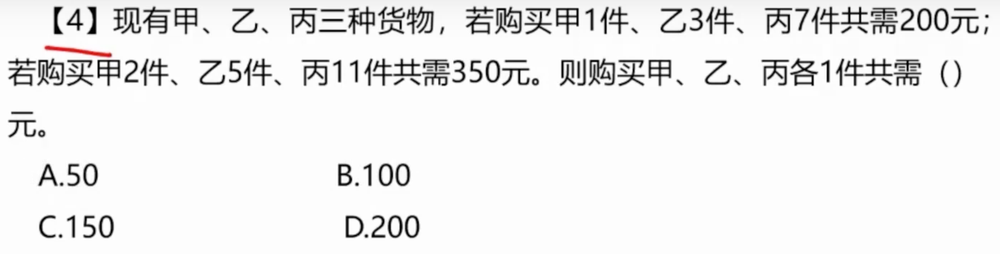
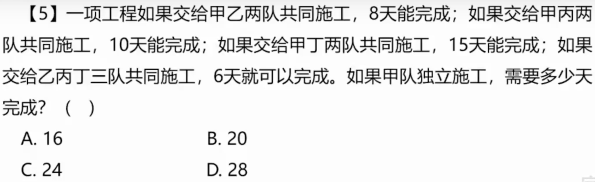
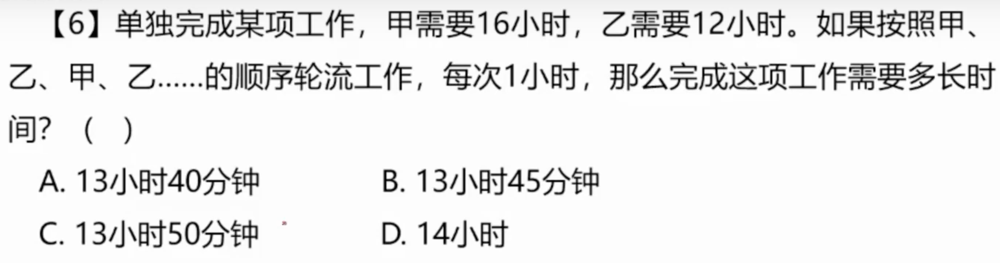
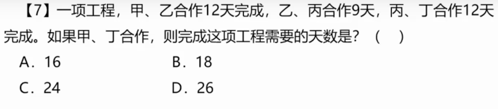
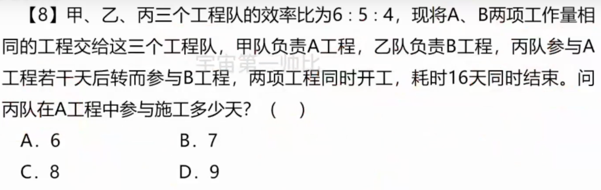
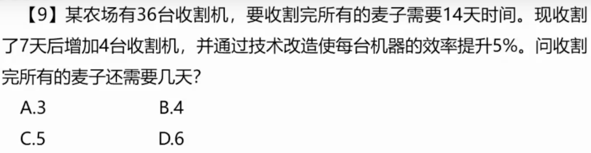
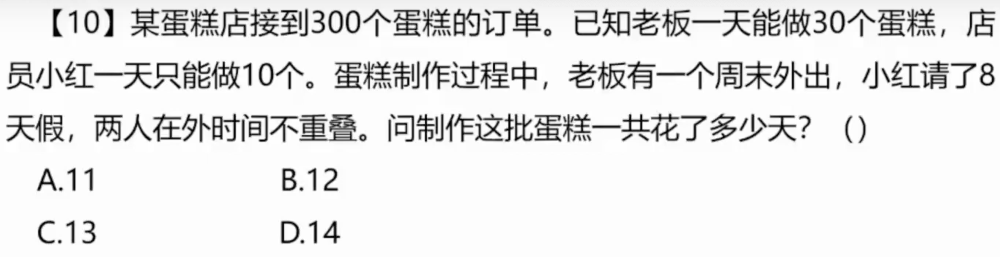

# 1.

## 1.1 题目

## 1.2 解法

**设钢琴教师带了 5x 名学生，拉丁舞教师带了 6x 名学生**

**那么得出方程：5x + 6x = 76，推出 5x 必为偶数**

**再结合题目说学生数量必须为质数，那么 x 只能为 2（质数中唯一的偶数）**

**那么可得 x = 2，y = 11，最后 4 * 2 + 3 * 11 = 41，答案 D**

# 2.

## 2.1 题目

## 2.2 解法

**根据题目列出方程：x + y + z = 10; 10x + 8y + 5z = 75**

**进行消元得出：5x + 3y = 25，看出：3y 必须为 5 的倍数，那么 y = 5**

**最终得出 x = 2，答案 B**

# 3

## 3.1 题目

## 3.2 解法

**本题解法列方程组**

**800x + 700y + 500z = 6700; x + y + z = 11**

**消除 y，最后得出 2z - x = 10，带入选项 D 得出答案**

# 4

## 4.1 题目

## 4.2 解法

**题目说求：x + y + z = ？，必须想到`赋0法`**

**列出方程：x + 3y + 7z = 200; 2x + 5y + 11z = 350;**

**把 z 赋值为 0，得出 y = 50，x = 50**

**得出答案 x + y + z = 100，答案 B**

# 5

## 5.1 题目

## 5.2 题解

**看题得出，题目为工程问题，并且给出了时间**

**得出结论：总量 = 效率 * 时间**

**甲乙共同 8天**

**甲丙共同 10天**

**甲丁共同 15天**

**乙丙丁共同 6 天**

**那么我们可以找到时间的最小公倍数为：120 天**

**上面3个等式相加 - 第四个得出 3个甲 为 15，那么甲的效率为 5**

**总共 120天，那么甲需要 24 天，答案选 C**

# 6

## 6.1 题目

## 6.2 解法

**工程问题，公式：总量 = 效率 * 时间**

**16 和 12 最小公倍数 48，那么甲的效率为 3，乙的效率为 4**

**那么可以得出需要 13 小时 45 分钟，答案 B**

# 7

## 7.1 题目

## 7.2 解法

**工程问题，公式：总量 = 效率 * 时间**

**12、9 的最小公倍数 36**

**得出，甲乙效率为 3，乙丙效率为 4， 丙丁效率为 3**

**得出甲丁效率为 2，得出 36 / 2 = 18，答案B**

# 8

## 8.1 题目

## 8.2 解法

**题目说：2个工程A、B，甲乙丙效率比为 6、5、4，那么总量为 240，A、B工作量相同都为 120**

**2个工程同时开工、同时结束，并且干了 16 天，甲一直在 A 干，乙一直在 B 干，丙两边都干**

**那么按照甲为 6 的效率，16 天干了 96，剩下 24 为丙干的**

**那么根据丙的效率 4， 24 / 4 = 6，答案 A**

# 9

## 9.1 题目

## 9.2 解法

**题目说，36台收割机需要14天，那么总量为 36 * 14**

**工作七天之后，增加 4 台收割机，并且效率增加 5%**

**也就是 (36 + 4) * 1.05，得出当前的效率**

**剩余量 36 * 7 / 上面的效率等于 6，答案 D**

# 10

## 10.1 题目

## 10.2 解法

**看题目列方程，设制作蛋糕花了 x 天**

**老板周末外出，其工作量为：30(x - 2)**

**小红请假八天，工作量为：10(x - 8)**

**列方程：30(x - 2) + 10(x - 8) = 300，得出 x 等于 11，答案A**