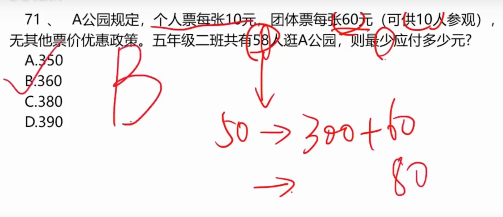
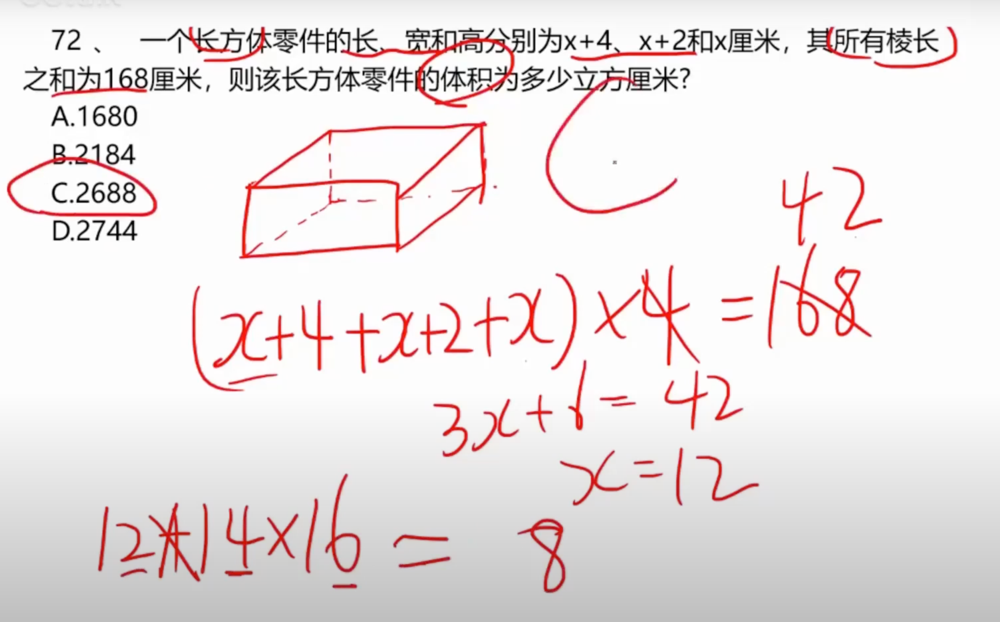
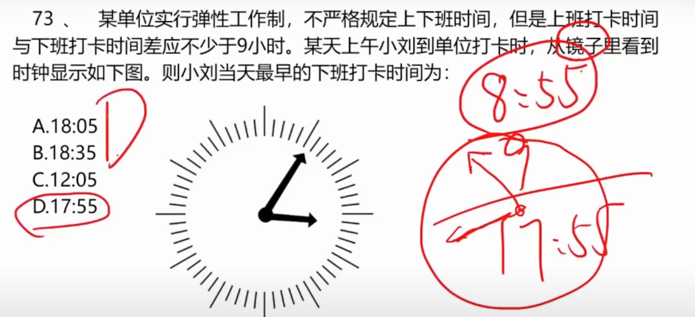
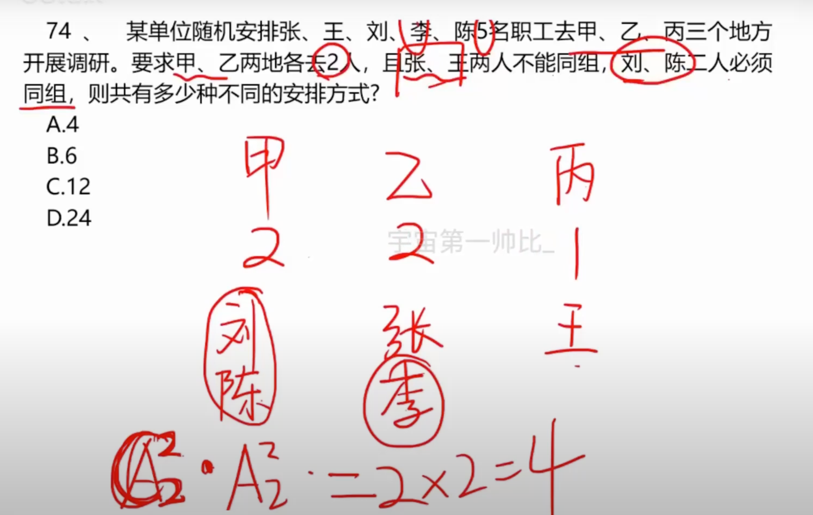
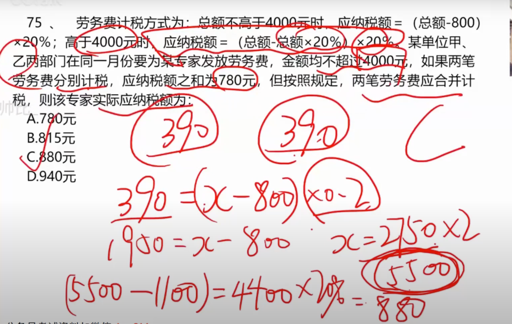
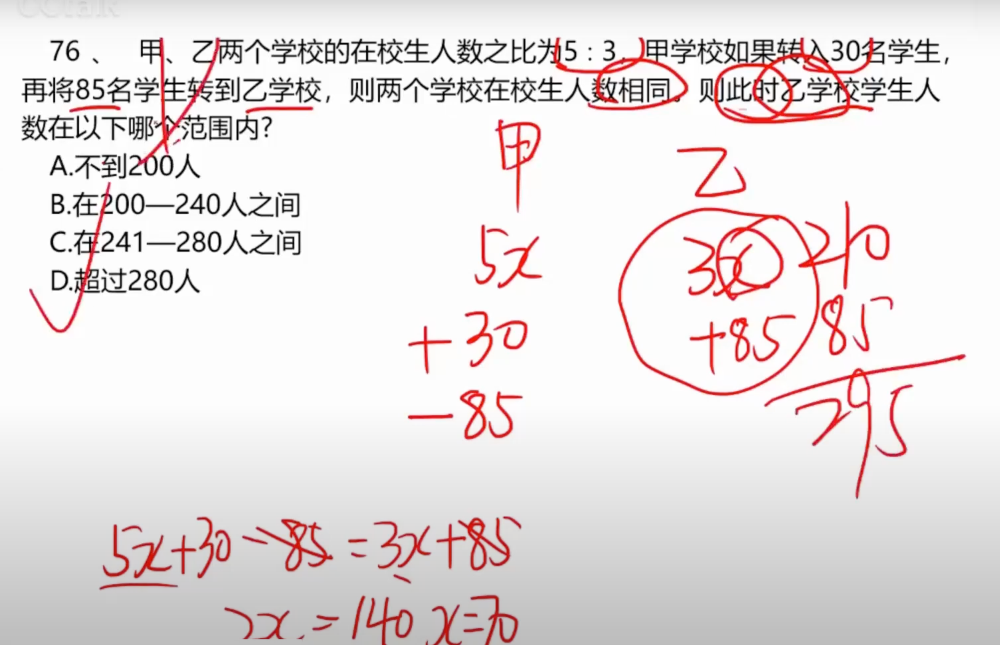
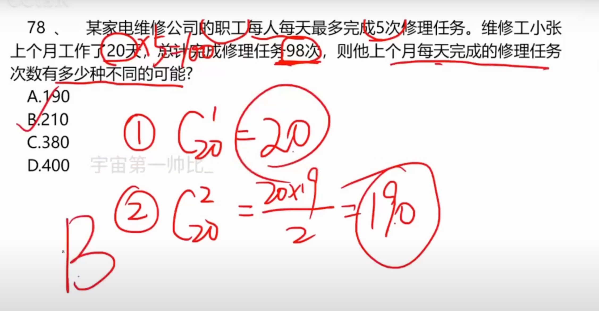
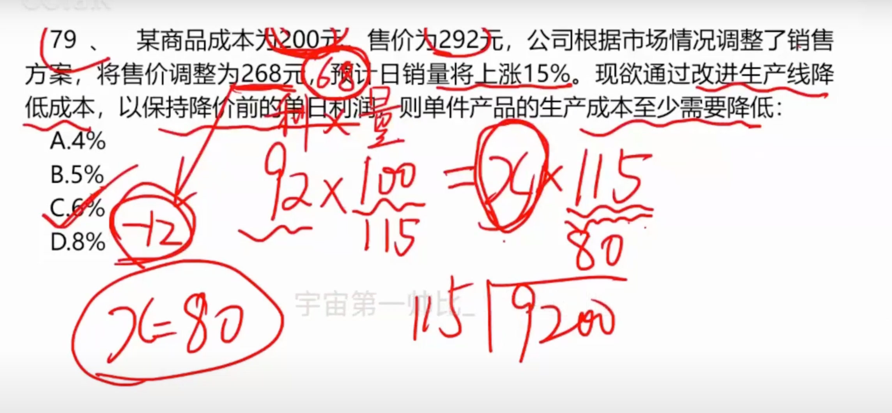
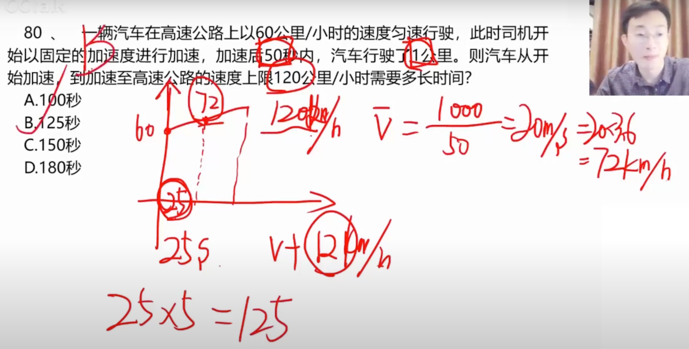
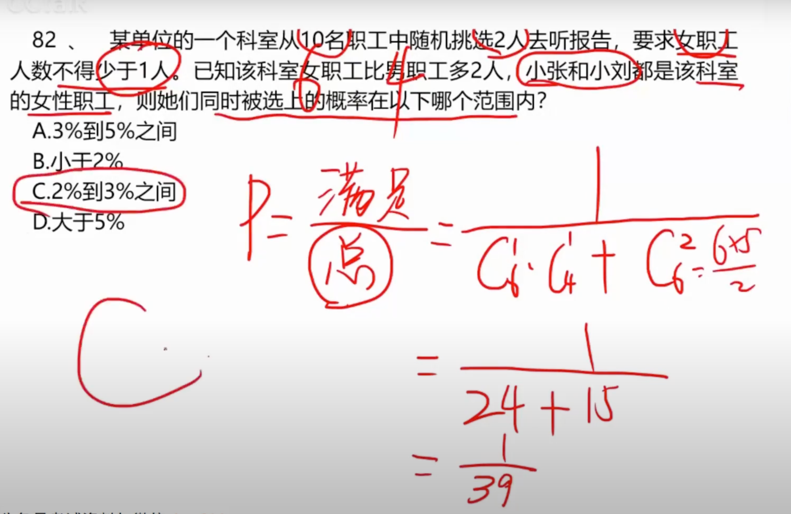

# 1

## 1.1 题目

## 1.2 理解

**首先 50 个人可以买五张团队票，总共 300元**

**剩下 8个人，单票总结80元，团队只要60，所以 360元**

# 2

## 2.1 题目

## 2.2 理解

**首先4倍的：长、宽、高 为 168，那么可以列方程解出来**

**最后相乘即可**

# 3

## 3.1 题目

## 3.2 理解

**这题没啥好说的，就是画个镜像图**

# 4

## 4.1 题目

## 4.2 理解

**刘、陈只能去甲乙，只有两种方法**

**张王，一个去乙，一个去丙，两种方法，其他没了**

# 5

## 5.1 题目

## 5.2 理解

**这题就是算出780原先是多少钱，然后算纳税即可**

# 6

## 6.1 题目

## 6.2 理解

**看图列方程**

# 7

## 7.1 题目

## 7.2 理解

**20天一共可以修100次**

**少两次可以是同一天，那么有 20次**

**少两次还可以是不同一天**

# 8

## 8.1 题目

## 8.2 理解

**列方程算出需要降价之后每件的利润**

**之后调整价格即可**

# 9

## 9.1 题目

## 9.2 理解

**1000米花了20s，那么每秒50米，那么72千米每小时**

**也就是说，看图：中途一半25s的时候增加了12千米每小时**

# 10

## 10.1 题目

## 10.2 理解

**女生比男生多两人，可以得出，女生6，男生4**

**之后使用概率即可**