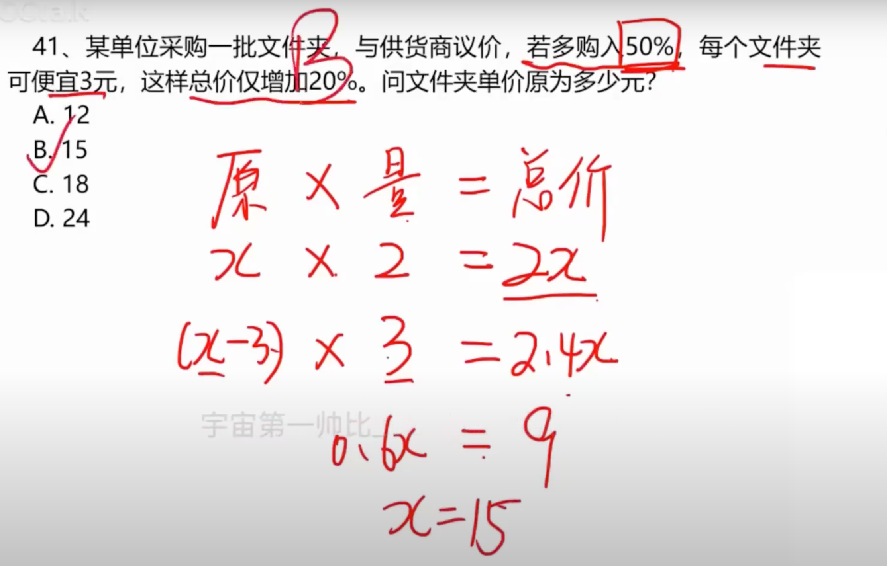
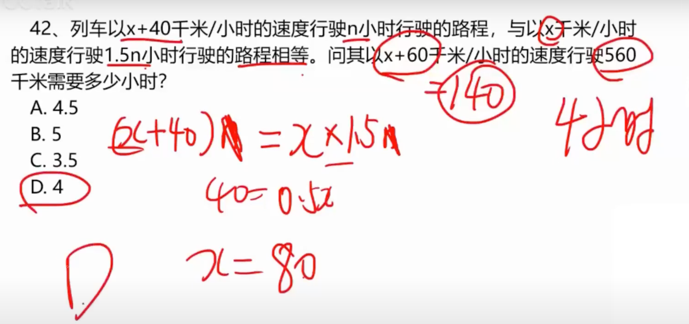
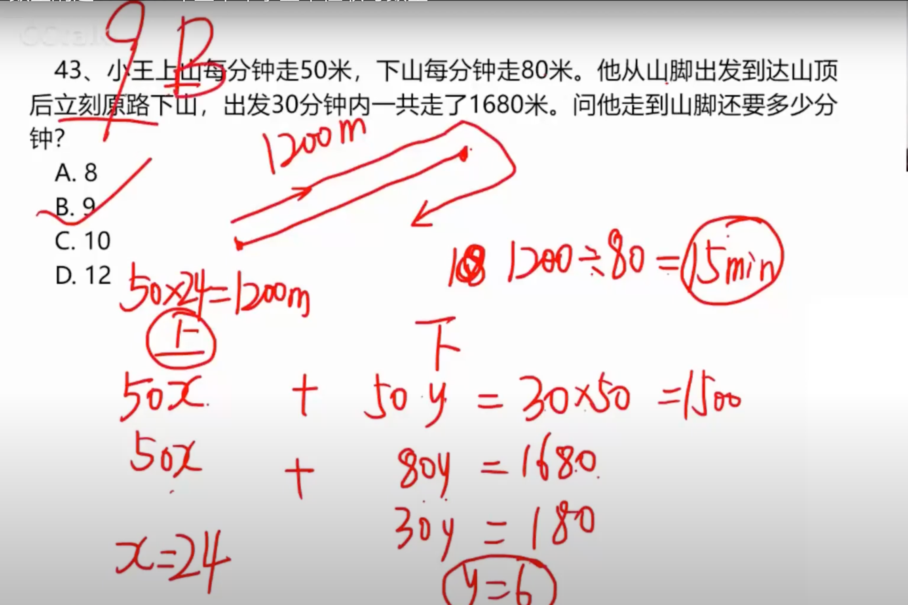
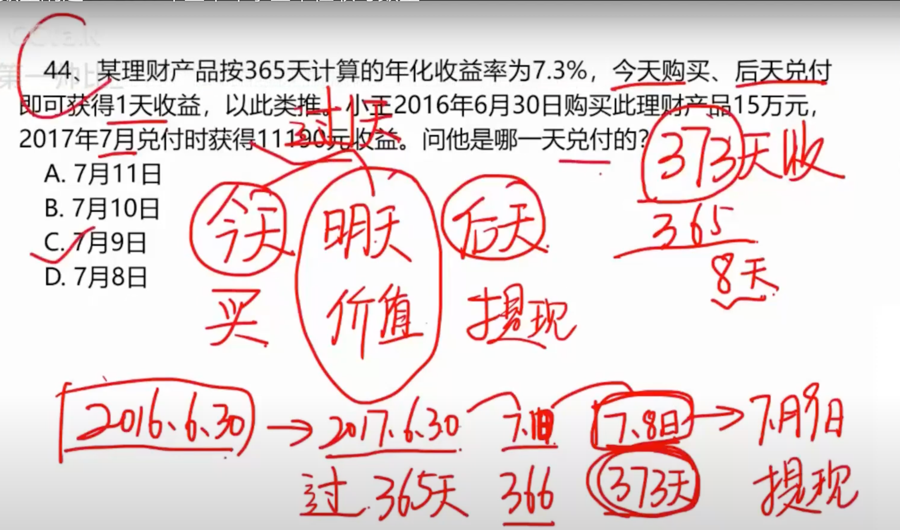
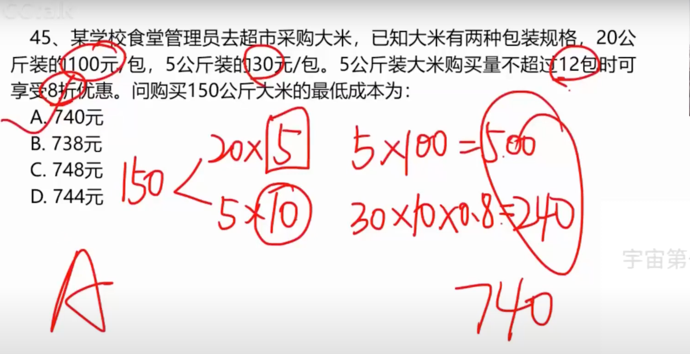
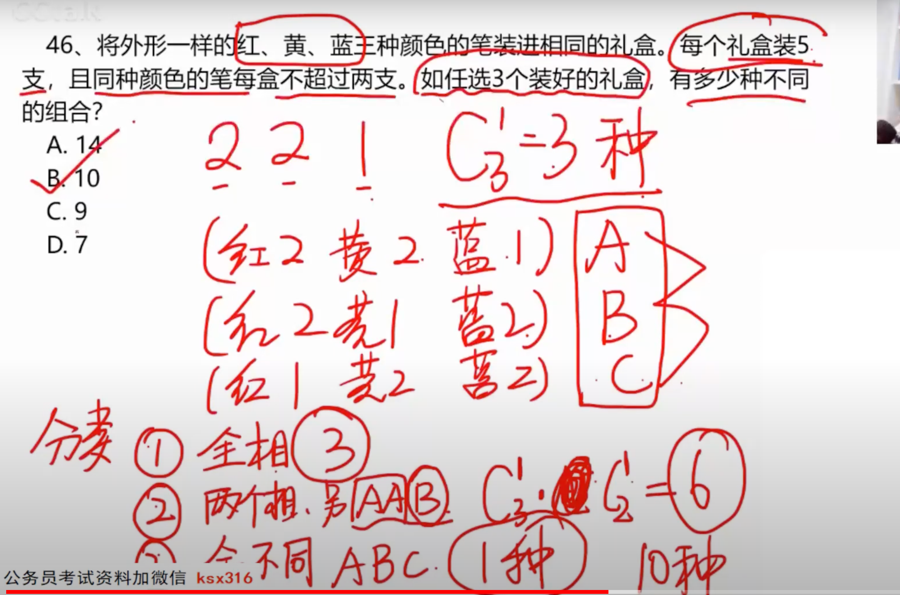
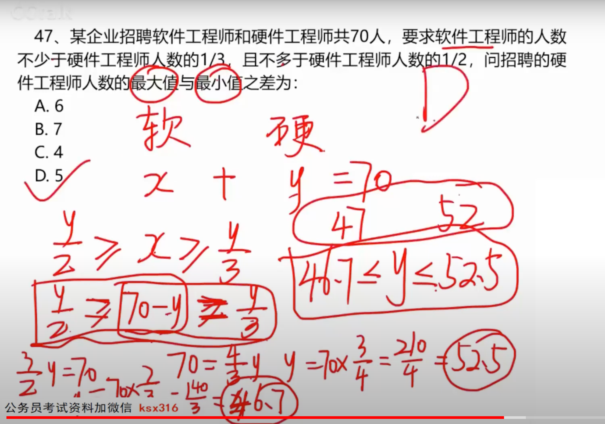
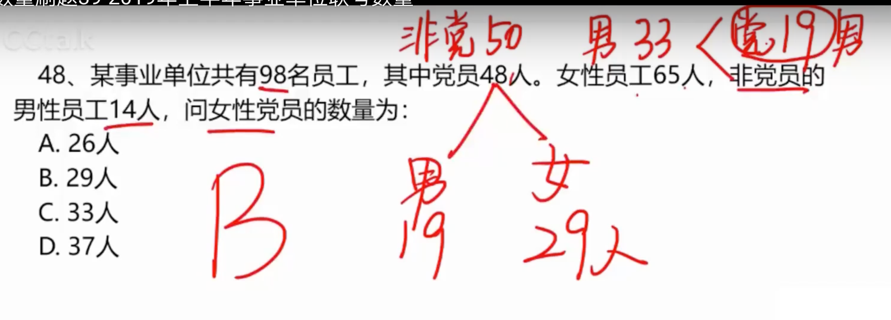
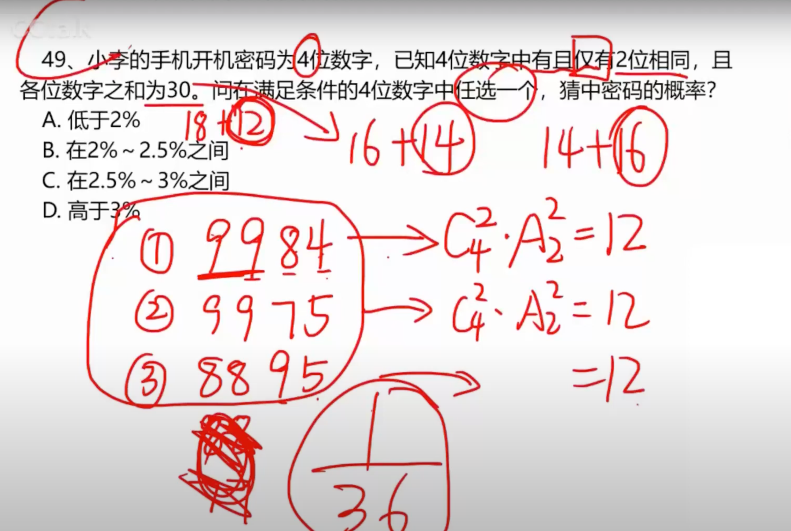
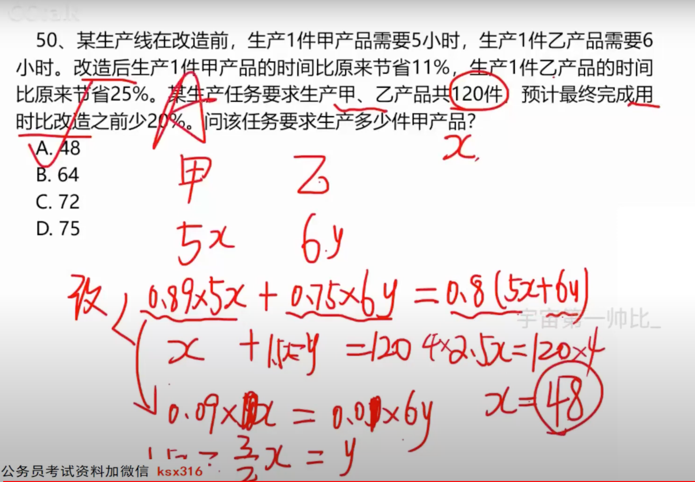

# 1

## 1.1 题目

## 1.2 理解

**公式：原价 * 数量 = 总价**

**看图列式，最后求得原价**

# 2

## 2.1 题目

## 2.2 理解

**列出等式，求出 x，最后求 x + 60 = 560**

# 3

## 3.1 题目

## 3.2 理解

**列出等式 x + y = 30; 50x + 80y = 1680；之后化简求出y、x**

**算出上山的距离，减去当前下山的距离，最后除以速度求出结果**

# 4

## 4.1 题目

## 4.2 理解

**今年到明年一共365，然后对付不算收益**

# 5

## 5.1 题目

## 5.2 理解

**因为5公斤的可以打八折，所以尽量多买**

**还需要凑整数**

# 6

## 6.1 题目

## 6.2 理解

**五支笔：组合一定是 2 2 1**

**那么一共有三种配法；现在抽三个礼盒：全相同、量相同、都不相同**

# 7

## 7.1 题目

## 7.2 理解

**首先列出等式：x + y = 70; 然后还有第二个，最后解方程**

# 8

## 8.1 题目

## 8.2 理解

**这题很简单，不多说**

# 9

## 9.1 题目

## 9.2 理解

**首先 30 的话有四种情况：9984、9975、8895**

**每一种是从四个数字里面选两个，并且有顺序**

# 10

## 10.1 题目

## 10.2 理解

**首先列出等式，然后算出 y 和 x 的对应关系**

**然后带入 x + 1.5x = 120**