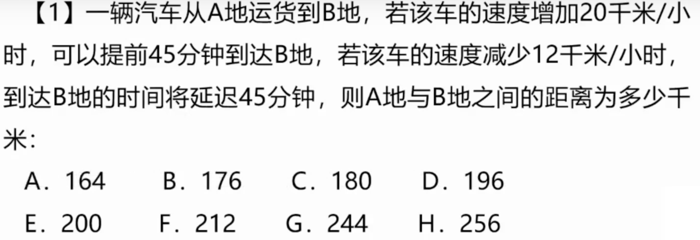
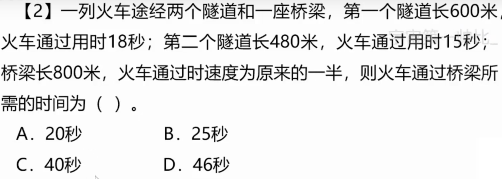
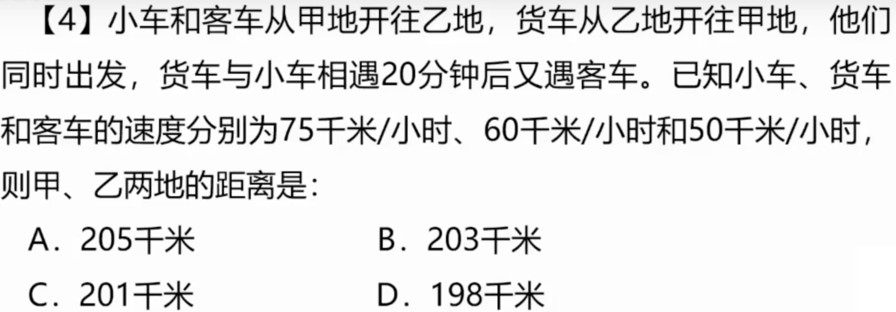
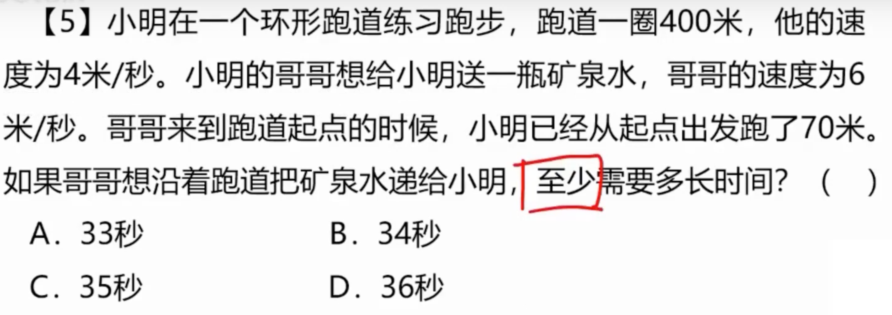
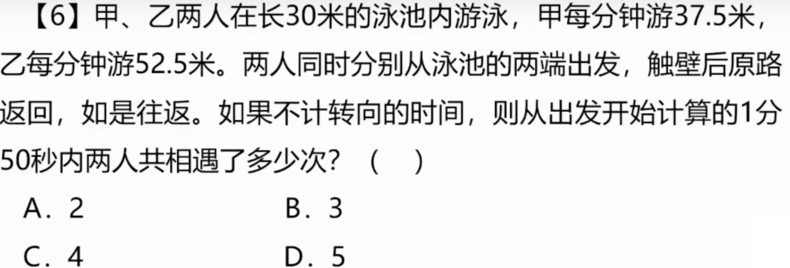
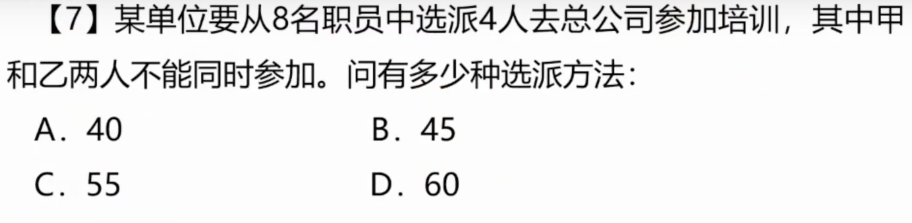
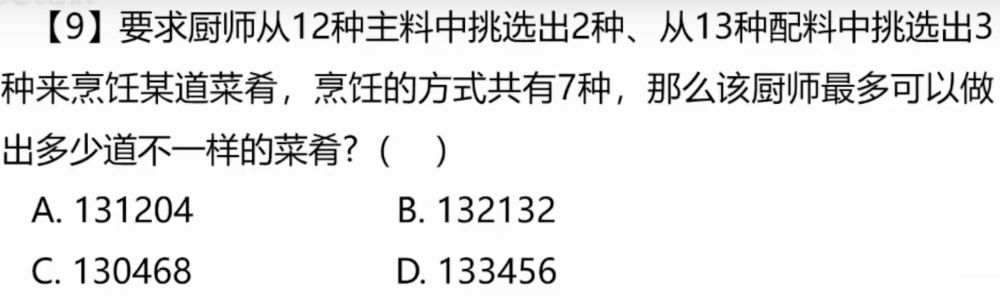
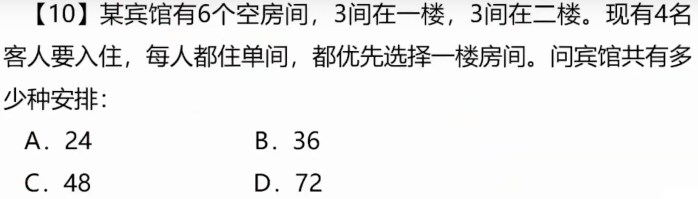

# 1

## 1.1 题目

## 1.2 解法

**题目说：速度加20，时间减45分钟；速度减少12，时间增加45分钟，工时 s = vt**

**方程：(v + 20)(t - 3/4) = vt; (v - 12)(t + 3/4) = vt**

**开出括号，解得 t = 3， v = 60；vt = 180，答案 C**

# 2

## 2.1 题目

## 2.2 解法

**还是熟读并背诵公式 s = vt;**

**第一个隧道：600 + L = 18v**

**第二个隧道：480 + L = 15v**

**联立上面两个方程，解得 v = 40，如果变为一半那就是 20**

**桥梁：（800 + 120）/ 20 = 46，答案 D**

# 3

## 3.1 题目

## 3.2 解法

**首先，动车已经开了 480，还剩下 1400**

**接下来用公式：(v + 160) * 4 = 1400，解得高铁速度等于 190，答案 D**

# 4

# 4.1 题目

## 4.2 解法

**套用公式 s = vt**

**方程1：(75 + 60)t = s**

**方程2：(50 + 60)(t + 1/3) = s**

**解得 t = 110/75，s = 198**

# 5

## 5.1 题目

## 5.2 解法

**首先正向思维，哥哥比弟弟快 2m/s，那么追上 70 需要 35s**

**但是环形跑道可以反方向跑，那么等于 330 / (4 + 6) = 33s**

**需要注意题目中的至少，答案 A**

# 6

## 6.1 题目

## 6.2 解法

**这题最重要的是画图**

**(37.5 + 52.5) / 30 = 5.5，也就是相遇了 3次(2n - 1)**

# 7

## 7.1 题目

## 7.2 解法

**排列组合题目**

**第一种情况：甲参加，乙不参加，再从另外几个人里边选 C(6, 3) = 20**

**第二种情况：甲不参加，乙参加，再从另外几个人里边选 C(6, 3) = 20**

**第三种情况：甲乙都不参加，从另外几个人里边选 C(6, 4) = 15**

**答案 C，一共 55 种**

# 8

## 8.1 题目

## 8.2 解法

**还是排列组合问题**

**第一种情况：只订一种 C(4, 1) = 4, 第二种情况：只订两种 C(4, 2) = 6**

**第三种情况：只订三种 C(4, 3) = 4, 第三种情况：全部订 C(4, 4) = 1**

**一共就是：4 + 6 + 4 + 1 = 15 种，答案 C**

# 9

## 9.1 题目

## 9.2 解法

**排列组合**

**C(12, 2) * C(13, 3) * 7，答案 B**

# 10

## 10.1 题目

## 10.2 解法

**先来的 3 个去一楼，C(4, 3) * A(3, 3)**

**后来的一个去 2 楼，C(3, 1)**

**相乘等于: 4 * 6 * 3 = 72， 答案 D**