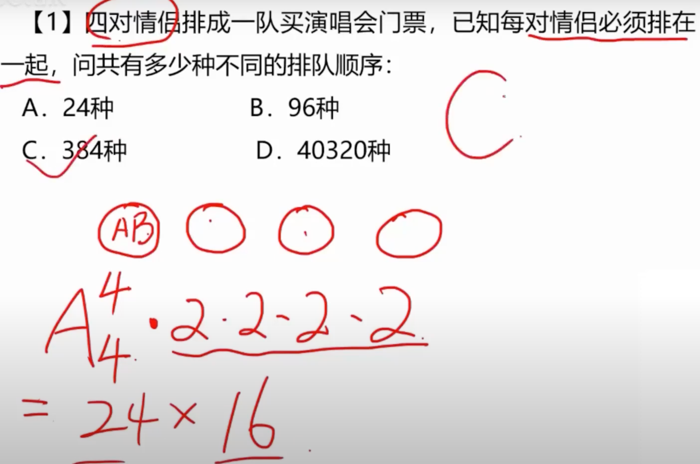
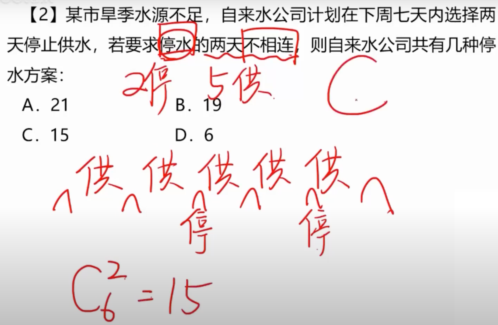
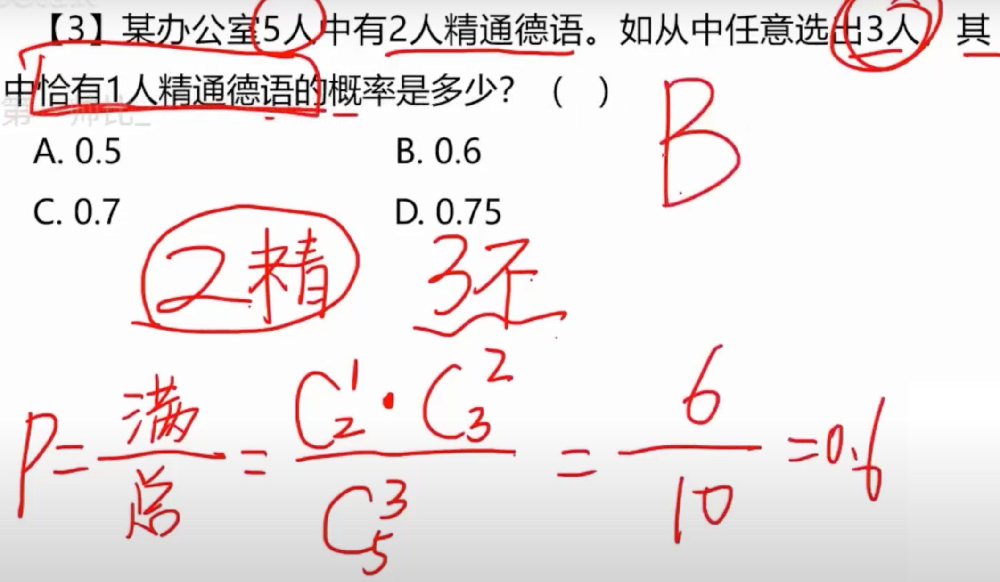
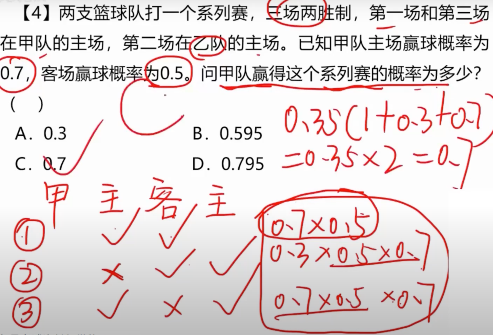
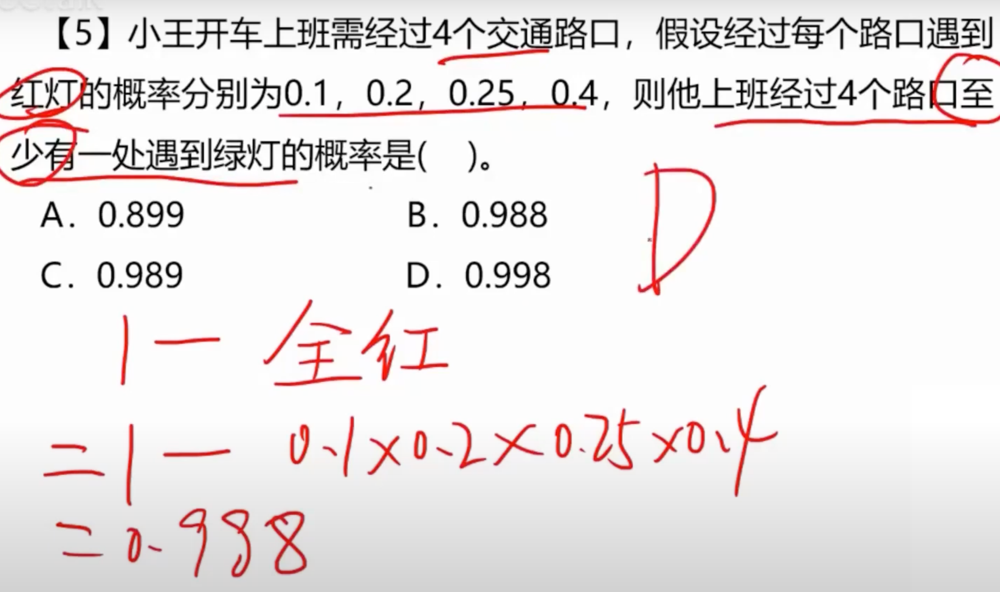
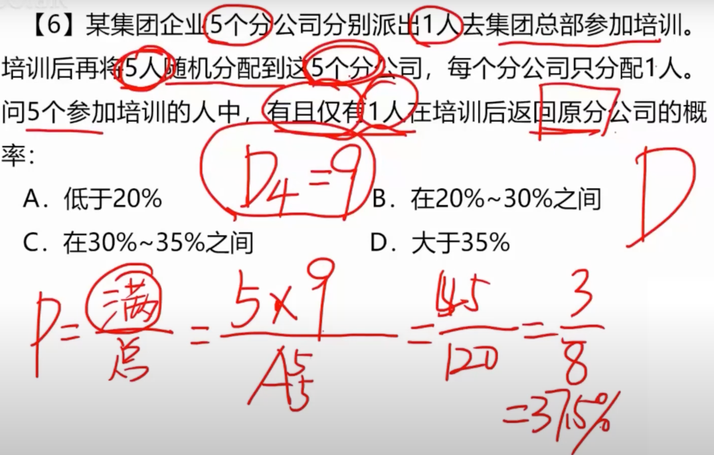
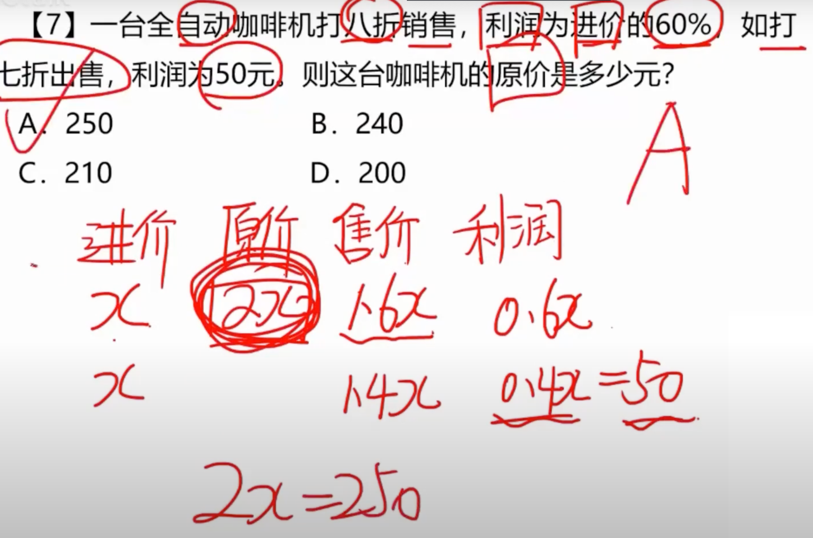

# 1

## 1.1 题目

## 1.2 解法

**捆绑排列**

**每对情侣看成一个单位，那么就有 A(4, 4) 种排法**

**每对情侣有两种排法：男前女后，女前男后**

**24 * 2 * 2 * 2 * 2，答案 C**

# 2

## 2.1 题目

## 2.2 解法

**排列，插空法**

**首先排 5 天供水，没有任何的顺序，可以随便排**

**再往 5 天供水中去插入 2 天停水，随便插入，总共是 C(6, 2) = 15，答案C**

# 3

## 3.1 题目

## 3.2 解法

**概率等于：满足条件 / 总数**

**满足条件：从 2 人中选中一人，C(2, 1); 从 3 人中任意选中 2 人，C(3, 2)**

**总数：从 5 人中选择 3 人，C(5, 3)**

**最后结果为 6 / 10, 答案 B**

# 4

## 4.1 题目

## 4.2 解法

**有 3 种情况：赢赢，输赢赢，赢输赢**

**那么结合三种情况，把概率相加即可，答案 C**

# 5

## 5.1 题目

## 5.2 解法

**反面想法：1 - 全是红灯的概率**

**等于：0.1 * 0.2 * 0.25 * 0.4 = 0.002，答案 D**

# 6

## 6.1 题目

## 6.2 解法

**首先，总数有 A(5, 5) 种选择，5 个人去 5 个分公司**

**只有一个人回到原先公司，那么每个人都有机会，有 5 中**

**剩下 4 个人，不能回到自己工时，错误排列**

** (5 * 9) / 120 = 3/8 = 37.5%，答案D**

# 7

## 7.1 题目

## 7.2 解法

**列表法**

**进价、原价、售价、利润**

**设进价为 x，那么理论为 0.6x，那么售价为 1.6x，那么原价为 1.6x / 0.7 = 2x**

**现在打 7 折，那么售价为 1.4x，利润为 0.4x = 50，那么 x = 250，答案A**