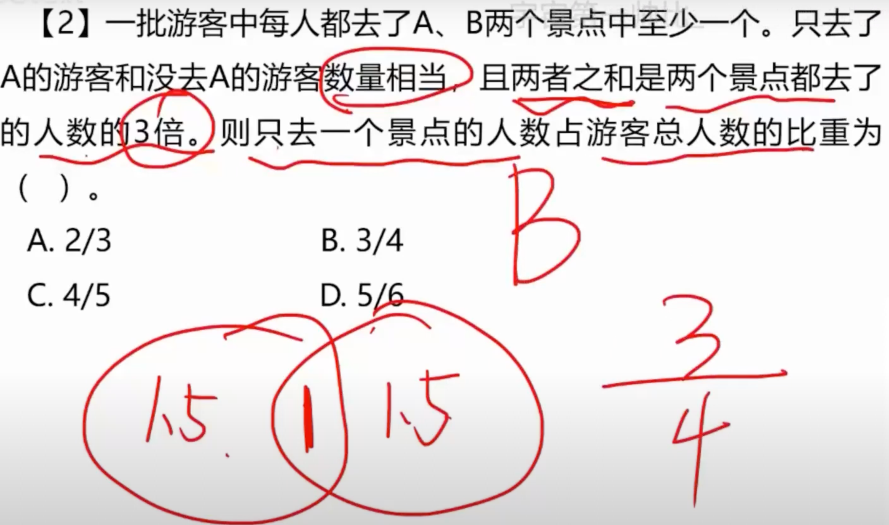
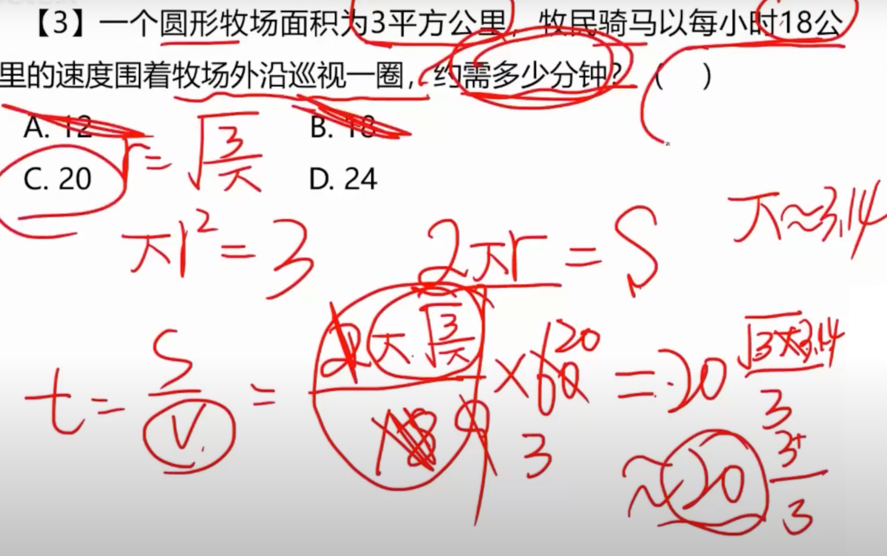
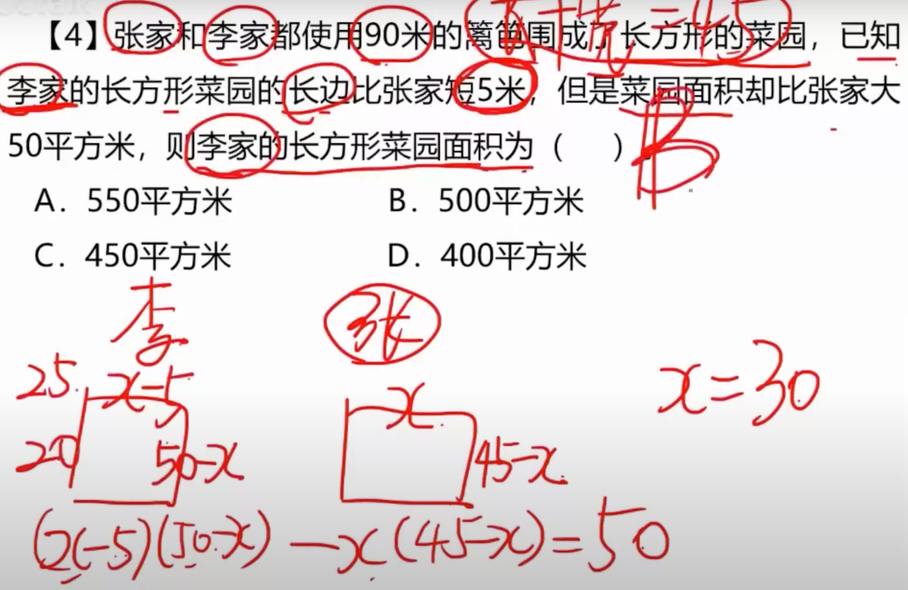
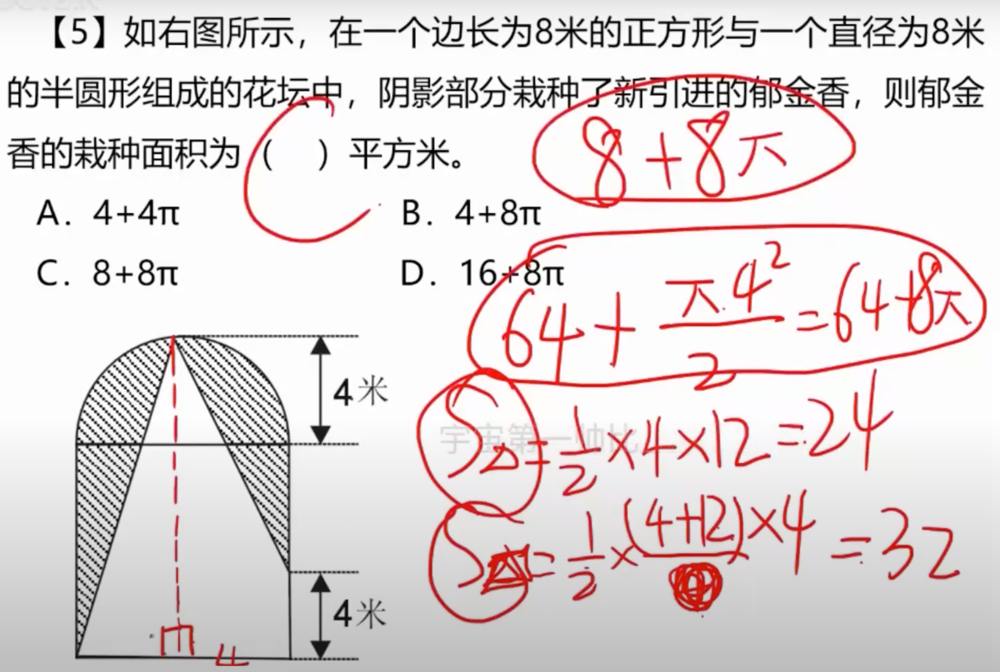
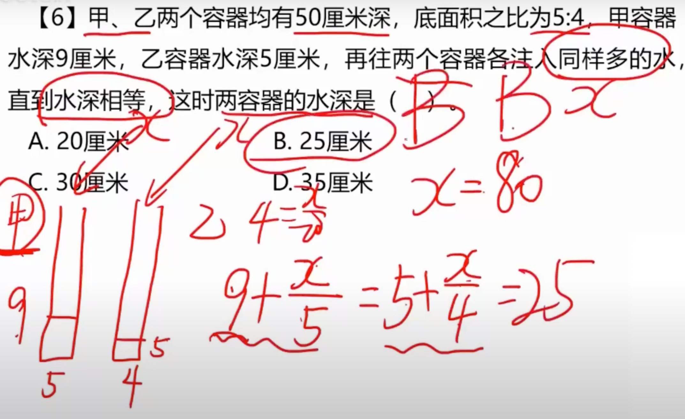
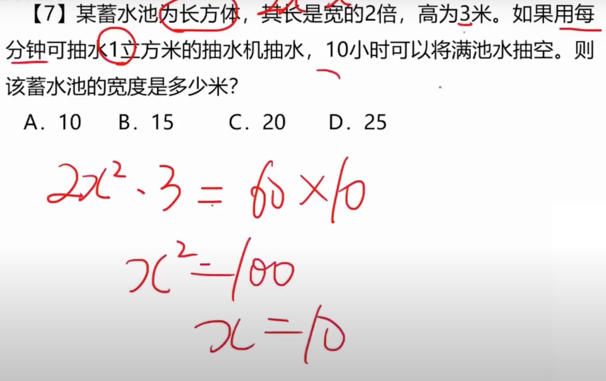
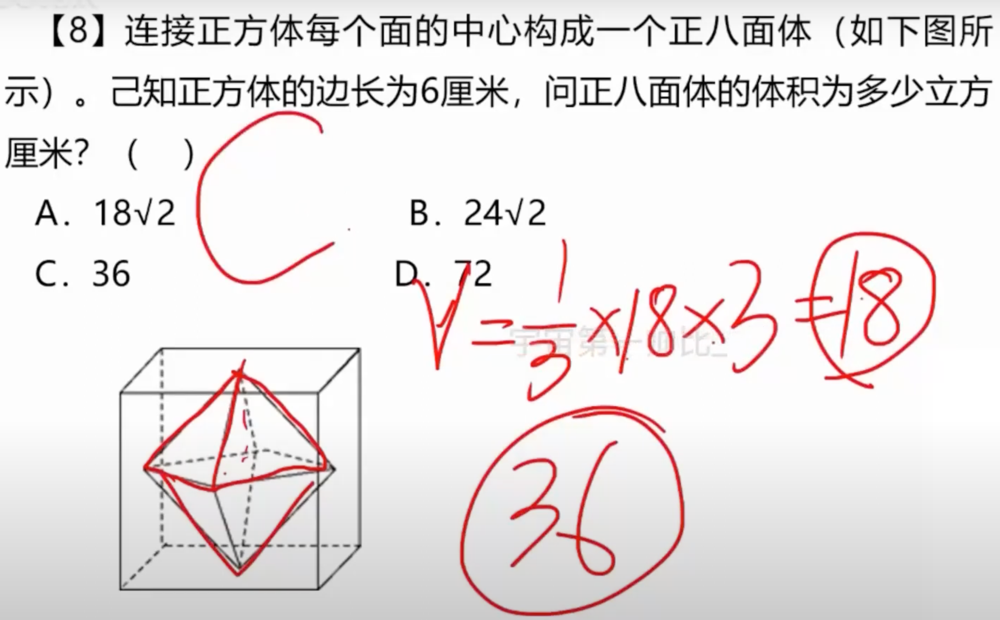
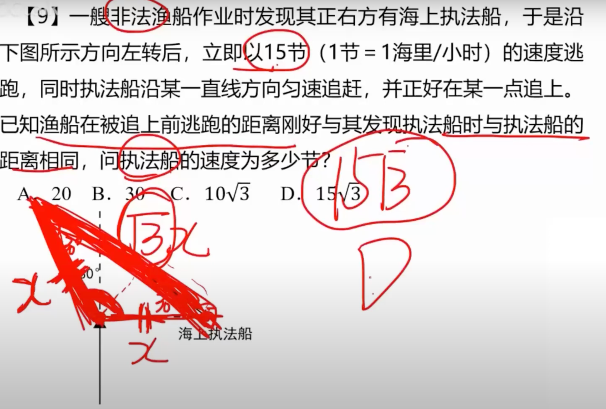
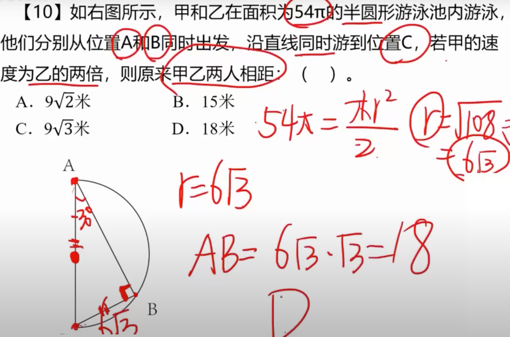

# 1

## 1.1 题目

## 1.2 解法

**题目说：只去了xxx，那么要用画图**

# 2

## 2.1 题目

## 2.2 解法

**公式：2πr，πr^2**

# 3

## 3.1 题目

## 3.2 解法

**画出菜园图形**

# 4

## 4.1 题目

## 4.2 解法

**重要的是需要会做辅助线**

# 5

## 5.1 题目

## 5.2 解法

**主要是会画容器图，和列方程**

# 6

## 6.1 题目

## 6.2 解法

**重要的是列方程**

# 7

## 7.1 题目

## 7.2 解法

**主要是看成两个棱锥，求底面积**

# 8

## 8.1 题目

## 8.2 解法

**主要是理解题目，算三角形斜边**

# 9

## 9.1

