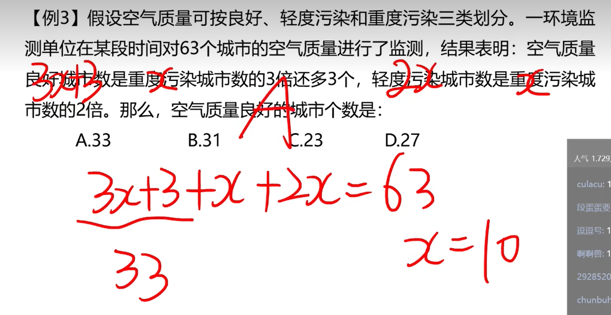
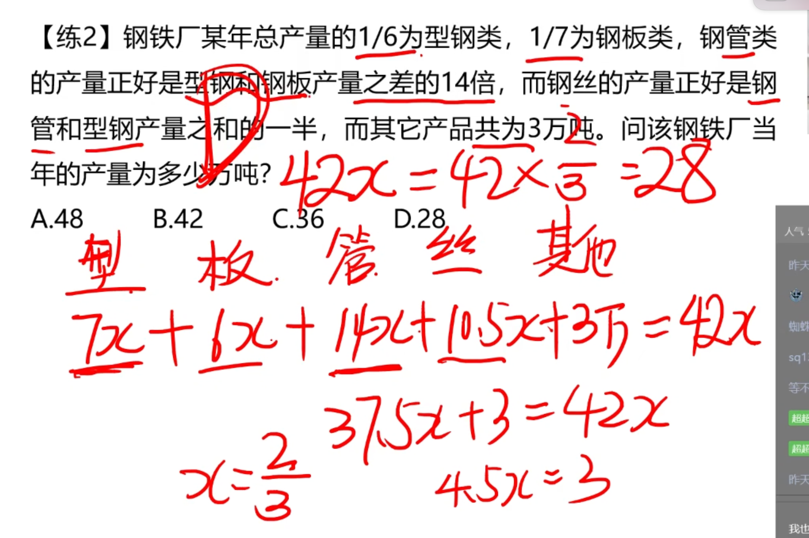
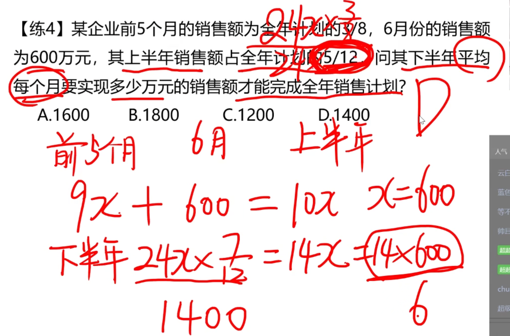
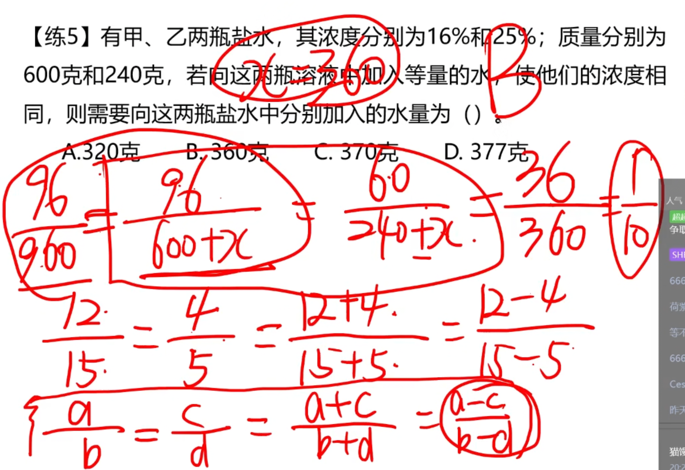

# 1

*设 10人桌 有 x，则 12人桌 有28-x

# 2

*和上题一样的思路*

# 3

*设重度污染为 x，然后列方程*

*额外：3倍多3，说明减3等于3的倍数*

# 4

*这题需要使用方程组，看答案求谁，就保留谁*

# 5

*甲三分之一，乙五分之一，设总数为15，那么丙丁占了7份*

# 6

**设钱数相同为 x**

# 7

**这题重要的是读题，然后列出方程即可**

# 8

**这题还是需要多读题，然后列出方程**

# 9

**还是需要读题，列出方程组，然后求解**

# 10

**还是读题，选最小公倍数，列方程**

# 11

**本题可以列出方程之后硬算，也可以使用简便方法**

# 12

**列出方程之后，可以发现相加有规律**